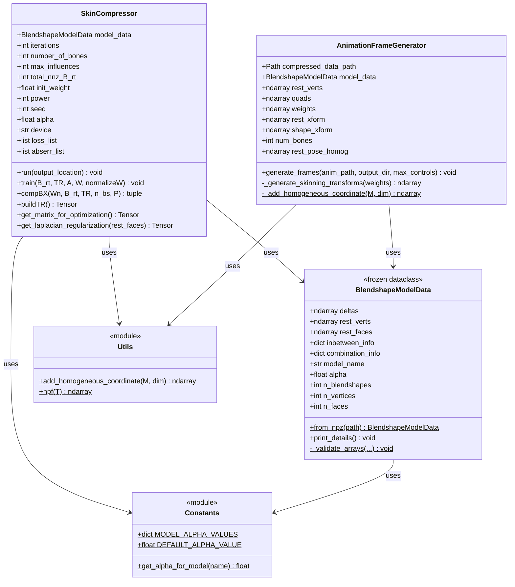

# Architecture Diagrams - metacompskin

This document contains Mermaid diagrams visualizing the architecture, data flow, and key algorithms of the `metacompskin` package.

---

## 1. Package Architecture Overview

```mermaid
graph TB
    subgraph "Input/Output"
        INPUT[📁 Input NPZ<br/>Blendshapes]
        OUTPUT[📁 Output NPZ<br/>Compressed Model]
        FRAMES[📁 OBJ Files<br/>Animation Frames]
    end

    subgraph "Main Components"
        DATA[📊 BlendshapeModelData<br/>Loads & validates data]
        COMPRESS[🔧 SkinCompressor<br/>Learns compact representation]
        ANIMATE[🎬 AnimationFrameGenerator<br/>Generates animation]
    end

    subgraph "Helpers"
        UTILS[⚙️ Utilities<br/>Math helpers]
    end

    INPUT --> DATA
    DATA --> COMPRESS
    COMPRESS --> OUTPUT
    OUTPUT --> ANIMATE
    ANIMATE --> FRAMES

    COMPRESS -.-> UTILS
    ANIMATE -.-> UTILS

    classDef io fill:#FFD93D,stroke:#CCB030,color:#000
    classDef main fill:#4A90E2,stroke:#2E5C8A,color:#fff
    classDef helper fill:#90EE90,stroke:#70CE70,color:#000

    class INPUT,OUTPUT,FRAMES io
    class DATA,COMPRESS,ANIMATE main
    class UTILS helper
```



---

## 2. Class Diagram - Core Classes



---

## 3. Data Flow - Compression Pipeline

```mermaid
flowchart TD
    START([Start]) --> LOAD[Load NPZ File]
    LOAD --> VALIDATE[Validate Arrays<br/>BlendshapeModelData]
    
    VALIDATE --> INIT[Initialize SkinCompressor<br/>Set parameters:<br/>P=40 bones<br/>K=8 influences<br/>L=6000 non-zeros]
    
    INIT --> GET_A[Get Matrix A<br/>Reshape deltas<br/>3S × N]
    GET_A --> GET_L[Compute Laplacian<br/>Regularization Matrix]
    GET_L --> BUILD_TR[Build TR Basis<br/>6-DOF transformation]
    
    BUILD_TR --> INIT_PARAMS[Initialize Parameters<br/>B_rt: random 6×S×P<br/>W: random P×N]
    
    INIT_PARAMS --> PHASE1{Phase 1<br/>normalizeW=False}
    PHASE1 --> TRAIN1[Train 10k iterations<br/>Adam + Projection]
    
    TRAIN1 --> PHASE2{Phase 2<br/>normalizeW=True}
    PHASE2 --> TRAIN2[Train 10k iterations<br/>Adam + Projection]
    
    TRAIN2 --> NORMALIZE[Normalize Weights<br/>W_n = W / Σ W]
    
    NORMALIZE --> EVAL[Evaluate Errors<br/>MAE, MXE]
    
    EVAL --> SAVE[Save NPZ<br/>rest, quads, weights<br/>restXform, shapeXform]
    
    SAVE --> END([End])
    
    style START fill:#90EE90
    style END fill:#FFB6C1
    style PHASE1 fill:#FFD93D
    style PHASE2 fill:#FFD93D
    style TRAIN1 fill:#4A90E2,color:#fff
    style TRAIN2 fill:#4A90E2,color:#fff
```



---

## 4. Data Flow - Animation Generation

```mermaid
flowchart TD
    START([Start]) --> LOAD_COMP[Load Compressed NPZ<br/>weights, shapeXform]
    LOAD_COMP --> LOAD_MODEL[Load Model Data<br/>inbetween, corrective info]
    
    LOAD_MODEL --> LOAD_ANIM[Load Animation NPZ<br/>control weights]
    
    LOAD_ANIM --> LOOP_START{For each frame}
    
    LOOP_START --> RIG[Apply Rig Logic<br/>72 controls → S blendshapes]
    
    RIG --> GEN_XFORM[Generate Skinning Transforms<br/>Equation 7: M_j = I + Σ c_k N_k,j]
    
    GEN_XFORM --> APPLY_SKIN[Apply Skinning<br/>X = weights ⊗ rest_pose<br/>result = M @ X]
    
    APPLY_SKIN --> SAVE_OBJ[Save OBJ File<br/>frame_XXXXX.obj]
    
    SAVE_OBJ --> LOOP_END{More frames?}
    LOOP_END -->|Yes| LOOP_START
    LOOP_END -->|No| END([End])
    
    style START fill:#90EE90
    style END fill:#FFB6C1
    style RIG fill:#7B68EE,color:#fff
    style GEN_XFORM fill:#4A90E2,color:#fff
    style APPLY_SKIN fill:#4A90E2,color:#fff
```



---

## 5. Training Loop - Proximal Adam Algorithm

```mermaid
flowchart TD
    START([Start Training]) --> INIT_OPT[Initialize Adam Optimizer<br/>lr=1e-3, β=(0.9, 0.9)]
    
    INIT_OPT --> LOOP{For i in<br/>iterations}
    
    LOOP --> NORM_W{normalizeW?}
    NORM_W -->|True| W_NORM[W_n = W / Σ W]
    NORM_W -->|False| W_RAW[W_n = W]
    
    W_NORM --> FORWARD
    W_RAW --> FORWARD[Forward Pass<br/>B·C = compBX]
    
    FORWARD --> LOSS[Compute Loss<br/>L_p + α·Laplacian]
    
    LOSS --> BACKWARD[Backward Pass<br/>Compute Gradients]
    
    BACKWARD --> ADAM[Adam Step<br/>Update B_rt, W]
    
    ADAM --> PROJ_START[Proximal Projection]
    
    PROJ_START --> PROJ_W[Project W:<br/>1. Keep K largest per vertex<br/>2. Clamp to non-negative]
    
    PROJ_W --> PROJ_B[Project B_rt:<br/>Keep L largest globally]
    
    PROJ_B --> LOG{i % 200 == 0?}
    LOG -->|Yes| PRINT[Print Progress<br/>Loss, Error, Sparsity]
    LOG -->|No| CHECK
    PRINT --> CHECK
    
    CHECK{i < iterations?}
    CHECK -->|Yes| LOOP
    CHECK -->|No| END([End Training])
    
    style START fill:#90EE90
    style END fill:#FFB6C1
    style PROJ_W fill:#FF6B6B,color:#fff
    style PROJ_B fill:#FF6B6B,color:#fff
    style ADAM fill:#4A90E2,color:#fff
```

---

## 6. Matrix Decomposition - compBX

```mermaid
flowchart LR
    subgraph "Input"
        W_N[W_n<br/>P × N<br/>Weights]
        B_RT[B_rt<br/>6 × S × P<br/>Parameters]
        TR[TR<br/>6 × 1 × 1 × 3 × 4<br/>Basis]
        REST[rest_pose<br/>N × 4<br/>Vertices]
    end
    
    subgraph "Compute C"
        W_N --> UNSQUEEZE[unsqueeze<br/>P × 1 × N]
        REST --> BROADCAST
        UNSQUEEZE --> MUL[Element-wise<br/>Multiply]
        BROADCAST[broadcast] --> MUL
        MUL --> PERMUTE[permute<br/>P × 4 × N]
        PERMUTE --> RESHAPE_C[reshape<br/>4P × N]
        RESHAPE_C --> C[C Matrix<br/>4P × N]
    end
    
    subgraph "Compute B"
        B_RT --> LOOP[Loop i=0..5:<br/>Sum B_rt[i] * TR[i]]
        TR --> LOOP
        LOOP --> PERMUTE_B[permute<br/>S × 3 × P × 4]
        PERMUTE_B --> RESHAPE_B[reshape<br/>3S × 4P]
        RESHAPE_B --> B[B Matrix<br/>3S × 4P]
    end
    
    subgraph "Output"
        B --> MATMUL[Matrix<br/>Multiply]
        C --> MATMUL
        MATMUL --> BX[BX = B @ C<br/>3S × N]
        B --> OUT_B[Return B]
        C --> OUT_C[Return X]
        BX --> OUT_BX[Return BX]
    end
    
    style C fill:#4A90E2,color:#fff
    style B fill:#7B68EE,color:#fff
    style BX fill:#50C878,color:#fff
```

---

## 7. Transformation Basis - buildTR

```mermaid
graph TD
    subgraph "6-DOF Transformation Basis"
        TR1["TR[0]<br/>Rotation around Z<br/>[ 0  0  0  0]<br/>[ 0  0 -1  0]<br/>[ 0  1  0  0]"]
        TR2["TR[1]<br/>Rotation around Y<br/>[ 0  0  1  0]<br/>[ 0  0  0  0]<br/>[-1  0  0  0]"]
        TR3["TR[2]<br/>Rotation around X<br/>[ 0 -1  0  0]<br/>[ 1  0  0  0]<br/>[ 0  0  0  0]"]
        TR4["TR[3]<br/>Translation X<br/>[ 0  0  0  1]<br/>[ 0  0  0  0]<br/>[ 0  0  0  0]"]
        TR5["TR[4]<br/>Translation Y<br/>[ 0  0  0  0]<br/>[ 0  0  0  1]<br/>[ 0  0  0  0]"]
        TR6["TR[5]<br/>Translation Z<br/>[ 0  0  0  0]<br/>[ 0  0  0  0]<br/>[ 0  0  0  1]"]
    end
    
    subgraph "Combination"
        COMBINE["N_k,j = Σ B_rt[i,k,j] * TR[i]<br/><br/>Result: 3×4 matrix<br/>[ 0   -r3   r2   t1]<br/>[ r3   0   -r1   t2]<br/>[-r2   r1   0    t3]"]
    end
    
    subgraph "Properties"
        PROP1[Linearized Rotation<br/>Skew-symmetric 3×3]
        PROP2[Linear Blending<br/>Closed under addition]
        PROP3[Fast Evaluation<br/>No quaternion slerp]
    end
    
    TR1 --> COMBINE
    TR2 --> COMBINE
    TR3 --> COMBINE
    TR4 --> COMBINE
    TR5 --> COMBINE
    TR6 --> COMBINE
    
    COMBINE --> PROP1
    COMBINE --> PROP2
    COMBINE --> PROP3
    
    style TR1 fill:#FFB6C1
    style TR2 fill:#FFB6C1
    style TR3 fill:#FFB6C1
    style TR4 fill:#B0E0E6
    style TR5 fill:#B0E0E6
    style TR6 fill:#B0E0E6
    style COMBINE fill:#50C878,color:#fff
```



---

## 8. Sequence Diagram - Full Workflow


---

## 9. State Machine - Training States


---

## 10. Component Interaction - Runtime


---

## 11. Memory Layout - Tensor Shapes


---

## Notes

- **S**: Number of blendshapes
- **N**: Number of vertices
- **P**: Number of proxy bones (default 40)
- **K**: Maximum influences per vertex (default 8)
- **F**: Number of faces

All diagrams follow the paper notation and reference equations where applicable.

