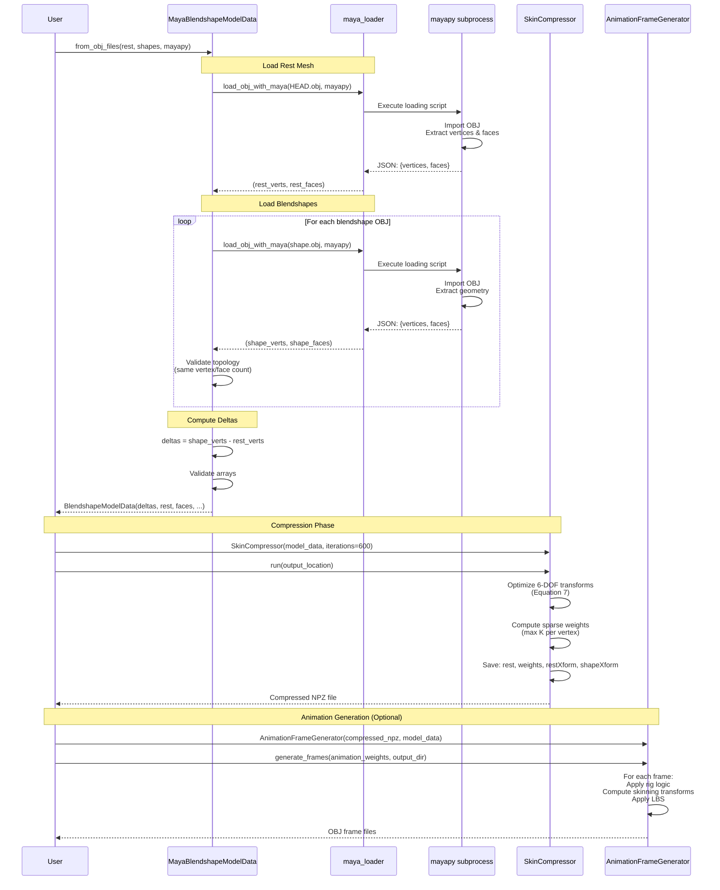
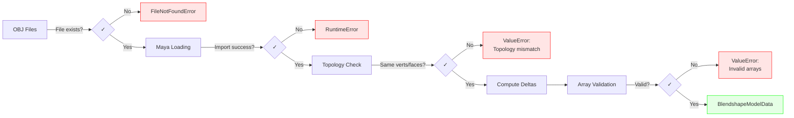

# Maya Data Flow - OBJ to Compressed Model

This document shows the complete data flow from OBJ files through Maya loading, compression, and final output.

---

## Complete Pipeline Sequence



---

## Data Structures at Each Stage

### 1. Input - OBJ Files
```
HEAD.obj          → rest mesh (neutral pose)
AU1.obj           → blendshape target 1
AU2.obj           → blendshape target 2
ShapeJawOpen.obj  → blendshape target 3
```

### 2. Loaded Geometry
```python
rest_verts: NDArray[float64]    # Shape: (N, 3)
rest_faces: NDArray[int32]      # Shape: (F, 4) - quads
shape_verts: List[NDArray]      # List of (N, 3) arrays
```

### 3. Computed Deltas
```python
deltas: NDArray[float64]        # Shape: (S, N, 3)
# Where S = number of blendshapes
#       N = number of vertices
```

### 4. BlendshapeModelData
```python
BlendshapeModelData(
    deltas: (S, N, 3),
    rest_verts: (N, 3),
    rest_faces: (F, 4),
    inbetween_info: dict,
    combination_info: dict,
    model_name: str,
    alpha: float
)
```

### 5. Compressed Output (NPZ)
```python
{
    'rest': (N, 3),              # Rest vertices
    'quads': (F, 4),             # Face connectivity
    'weights': (N, P),           # Sparse skinning weights
    'restXform': (3, 4*P),       # Rest transformations
    'shapeXform': (3*S, 4*P)     # Shape transformations (sparse)
}
# Where P = number of bones (typically 40)
```

---

## Timeline and Performance

| Stage | Duration | Notes |
|-------|----------|-------|
| **Load REST.obj** | ~5s | Subprocess startup + Maya init |
| **Load 3 shapes** | ~15s | 3 × ~5s per shape |
| **Compute deltas** | <0.1s | Vectorized numpy operation |
| **Validate topology** | <0.1s | Simple array shape checks |
| **Create model_data** | <0.1s | Dataclass instantiation |
| **Compression (600 iter)** | ~20s | GPU-accelerated optimization |
| **Total** | **~40s** | For 3 shapes, 5761 vertices |

### Scaling
- Loading time: ~5s per OBJ (linear)
- Compression time: ~10-30s (depends on iterations, not shape count)
- For 70 shapes: ~350s loading + ~30s compression = **~6.5 minutes**

---

## Error Handling Points

The pipeline includes validation at multiple stages:



---

## Integration with Existing Pipeline

The Maya loading system integrates seamlessly with the existing compression pipeline:

```
[Maya OBJ Files]
       ↓
[MayaBlendshapeModelData.from_obj_files()]  ← NEW
       ↓
[BlendshapeModelData]                       ← Existing interface
       ↓
[SkinCompressor]                            ← Existing
       ↓
[Compressed NPZ]                            ← Existing
       ↓
[AnimationFrameGenerator]                   ← Existing
       ↓
[OBJ Frame Files]                           ← Existing
```

**Key Design Decision**: MayaBlendshapeModelData returns standard BlendshapeModelData, so all downstream code works without modification.
