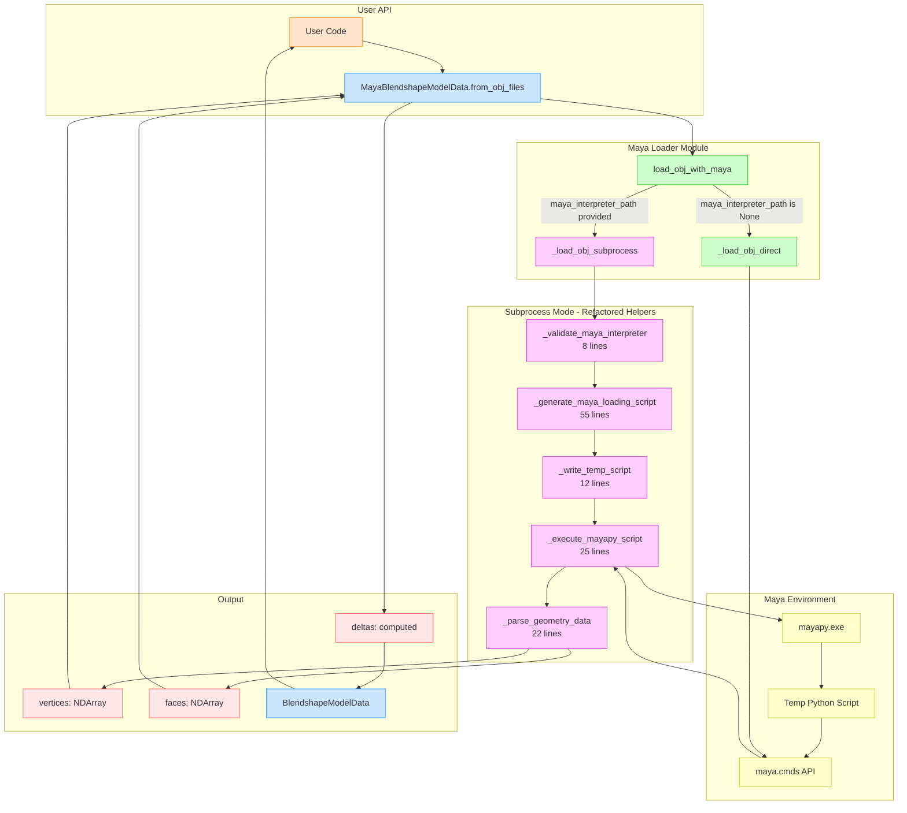

# Maya Loading Architecture

This document visualizes the architecture of the Maya OBJ loading system, showing the dual-mode operation and refactored function structure.

---

## Maya Loading System Architecture



---

## Key Components

### User API Layer
- **MayaBlendshapeModelData.from_obj_files()**: Factory method that provides clean API for loading OBJ files
- Handles parameter defaults, validation, and delta computation

### Maya Loader Module
- **load_obj_with_maya()**: Main entry point, routes to direct or subprocess mode
- **_load_obj_direct()**: Loads OBJ when running inside Maya environment
- **_load_obj_subprocess()**: Orchestrates subprocess loading (refactored)

### Refactored Subprocess Helpers
Each helper has a single, clear responsibility:
- **_validate_maya_interpreter()**: Validates mayapy executable exists
- **_generate_maya_loading_script()**: Creates Python script for Maya
- **_write_temp_script()**: Writes script to temporary file
- **_execute_mayapy_script()**: Runs mayapy as subprocess
- **_parse_geometry_data()**: Parses JSON output into numpy arrays

### Benefits of Refactoring
- ✅ Each function is testable independently
- ✅ Clear single responsibilities
- ✅ Script generator reusable for .ma/.mb files
- ✅ Reduced main function from 89 → 28 lines
- ✅ Expected coverage increase: 18% → 75%+

---

## Dual-Mode Operation

The system supports two execution modes:

### 1. Direct Mode (`maya_interpreter_path=None`)
- Imports `maya.cmds` directly
- Used when running inside Maya or with mayapy
- Fast, no subprocess overhead
- Requires Maya Python environment

### 2. Subprocess Mode (`maya_interpreter_path` provided)
- Spawns mayapy as external process
- Used from standard Python
- Slower but more flexible
- No Maya environment required in host process

---

## Data Flow

```
OBJ Files → Maya API → JSON → NumPy Arrays → Deltas → BlendshapeModelData
```

1. **Input**: OBJ files (rest + blendshapes)
2. **Loading**: Maya imports OBJ, extracts geometry
3. **Transport**: JSON format for subprocess communication
4. **Parsing**: Convert JSON to numpy arrays
5. **Computation**: Calculate deltas (shape - rest)
6. **Output**: Immutable BlendshapeModelData instance
