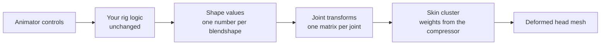

# Using Compressed Skinning Output in Maya: A Guide for Riggers

This guide explains what the compressor produces and how to think about it, so you
can bring the result into your own Maya rig and your own pipeline. It does not
prescribe a specific tool or node setup. Every studio wires rigs differently, and the
data is simple enough that once the principles are clear, you can adapt them to
whatever you already have.

You do not need to know the maths behind the paper. You do need to be comfortable
with skin clusters, joints, blendshape weights, and the idea of a matrix as
"a transform".

---

## 1. The big picture

A blendshape rig stores, for every shape, a position offset for every vertex. That is
accurate but heavy: with 250 shapes and 6000 vertices, that is 1.5 million offsets.

The compressor replaces that with a **skinned mesh driven by a small set of joints**
(about 40 by default). Instead of "when *jawOpen* is at 100%, move each of these 6000
vertices by this much", the data now says "when *jawOpen* is at 100%, move each of
these 40 joints by this much", and the skin weights spread that joint motion back onto
the vertices.



The only part of your rig that changes is the deformer. Everything upstream of the
shape values (controls, drivers, corrective logic, in-betweens) stays exactly as it is.
Everything downstream is a plain skin cluster, which is what game pipelines already
know how to export and run.

The result is an approximation. The compressor reports two numbers when it finishes:
the mean error and the maximum error across all shapes. For a typical head those are
well under a tenth of a millimetre on average and a few millimetres at worst. Look at
those numbers before you build anything: they tell you how close the skinned result
will be to the original targets.

---

## 2. What is in the output

The compressor writes a single `.npz` file (a NumPy archive). It contains five arrays.
The letters below are used throughout this repository:

| Letter | Meaning |
|--------|---------|
| `N` | number of vertices in the head mesh |
| `S` | number of blendshapes |
| `P` | number of joints (the paper calls them *bones*) |
| `K` | maximum number of joints influencing one vertex (8 by default) |

| Key | Size | What it is, in rigging terms |
|-----|------|------------------------------|
| `rest` | `N × 3` | The neutral head, one position per vertex, **centred on the origin** (see section 3.5). Same vertex order as the mesh you gave the compressor. |
| `quads` | `F × 4` | Face list of the neutral head. Only there so the file is self-contained. |
| `weights` | `N × P` | Skin weights. Row *i* is vertex *i*, column *j* is joint *j*. Each row adds up to 1 and has at most `K` non-zero values. This is exactly a skin cluster weight map. |
| `restXform` | `P × 3 × 4` | Where the joints sit in the neutral pose. Identity matrices unless you supplied your own joint placement. Cosmetic only (see section 3.1). |
| `shapeXform` | `3S × 4P` | The joint motion for every shape. One `3 × 4` block per (shape, joint) pair. About 90% of the blocks are all zeros. This is the heart of the data (see section 3.3). |

Alongside it you will usually have a `shape_names.json`: an ordered list of the
blendshape names. **The order matters.** Shape number 0 in `shapeXform` is the first
name in that list, and so on. If you have no such file, the order is the order in
which the shapes were given to the compressor.

If you want to see how the file is read and used, the reference implementation is
`AnimationFrameGenerator` in `src/metacompskin/animation_generator.py`. It is short
and does nothing more than what this guide describes.

---

## 3. The concepts you need

### 3.1 The joints are virtual, not anatomical

The compressor invents the joints. It does not know what a jaw or a cheek is. It
places influence where it best reproduces the shapes, so a joint may cover the left
side of the mouth and part of the nose at the same time. Do not expect them to line up
with a conventional facial skeleton, and do not try to rename or merge them into one.

Two consequences for your rig:

- **Joint position does not affect the deformation.** In the maths, every joint's rest
  transform is the identity. You may place the joints anywhere you like for display
  purposes; a common choice is the weighted average position of the vertices each
  joint influences, so the joint sits over the region it drives. If you supplied your
  own joint matrices to the compressor they are echoed back in `restXform`, and you
  can place the joints there. Either way, the skin cluster's bind pose takes care of
  the difference (see section 3.5).
- **The joints are independent.** Keep them in a flat hierarchy, all children of one
  root. Parenting one virtual joint under another changes what its local transform
  means and will break the result. A single root above all of them is fine, and is
  the usual way to attach the face to the rest of the character.

### 3.2 The skin weights are ordinary skin weights

`weights` is a regular linear blend skinning weight map: non-negative, normalised per
vertex, at most `K` influences. Apply it to a skin cluster as-is, with the joints in
the same order as the columns.

Do not touch them afterwards. The weights were solved together with the joint motion;
smoothing, pruning, re-normalising or painting them in Maya will move the result away
from the original shapes. If the weights need to change, change the inputs and run the
compressor again.

The mesh you bind must have the **same vertex order** as the mesh that was compressed.
Vertex count alone is not enough; a re-imported or re-topologised head with the same
count but a different order will deform as noise.

### 3.3 Each shape is a small motion of each joint

`shapeXform` is a grid of `3 × 4` blocks, one per (shape, joint). The block for shape
*k* and joint *j* is the **delta transform** `N[k, j]`: how joint *j* moves when shape
*k* is at 100% and nothing else is active. Think of it as a pose, stored per joint, per
shape.

To pull out one block: rows `3k` to `3k + 2`, columns `4j` to `4j + 3`.

About 90% of these blocks are exactly zero. A brow shape moves the two or three joints
around the brow and leaves the other 37 alone. That sparsity is the whole point of the
method: it is what makes it cheap to evaluate at runtime, and it is worth preserving
in your implementation (skip the zero blocks rather than multiplying by zero).

### 3.4 The mixing rule: joint transforms are added, not chained

This is the one rule to remember. For each joint *j*, at any frame:

```
M[j] = Identity + c[0] * N[0, j] + c[1] * N[1, j] + ... + c[S-1] * N[S-1, j]
```

where `c[k]` is the current value of shape *k* (what your rig would have fed into a
blendshape node). `M[j]` is the transform the joint must have at that frame.

This is the same arithmetic as blendshapes, applied to matrices instead of vertex
positions: a weighted sum of deltas on top of a neutral. Because of that:

- Shape values combine exactly the way they did before. The effect of several shapes
  at once is the sum of their individual effects, and the order in which you add
  them does not matter.
- Values outside 0 to 1 work the same way they would on a blendshape (overshoot,
  negative values).
- In-betweens and correctives are just more shapes. If your rig logic turns a control
  into "*jawOpen* 0.7, *jawOpen_50* 0.3, *jawOpen_lipsTogether* 0.2", those three
  values go straight into the sum. The compressor treated each of them as its own
  target.

It also means you are never *composing* rotations. You do not multiply the jaw's
rotation by the lip's rotation. You add the matrix deltas together, then hand the
result to the joint.

### 3.5 The transforms are not rigid

The deltas are built from linearised rotations plus translations. Adding two such
deltas does not give a clean rotation: the resulting `M[j]` will contain a small amount
of scale and shear. This is expected, and it is what the compressor optimised for.

A Maya joint can hold that: it has translate, rotate, scale and shear channels, and
setting all of them reproduces an arbitrary affine matrix exactly. Any pipeline that
**assumes joints are rigid** (rotation and translation only, or rotation and uniform
scale) will drop the scale and shear and introduce error. How much depends on the
shapes; large jaw motion is the usual place it shows. If your target pipeline has that
restriction, test it early on the shapes with the biggest motion, and read the
compression error report knowing that this restriction adds to it.

Do not "fix" the transforms by orthonormalising them or converting them to
quaternions. That silently discards part of the data.

### 3.6 Rest pose and coordinate space

The compressor centres the head before solving: it subtracts the average vertex
position, so `rest` sits on the world origin. All the transforms in `shapeXform` act on
those centred coordinates, and the joints' neutral transform is the identity at the
origin.

Your production head almost certainly does not sit on the origin. There are two clean
ways to reconcile this:

1. **Move the mesh to the centred position** when building the rig (vertices equal to
   `rest`). Simple, good for verification scenes, awkward for production.
2. **Keep the mesh where it is and account for the offset in the joints.** Let `c` be
   the offset between your mesh and `rest` (the average vertex position of your mesh,
   if the mesh is otherwise identical). Then what the skin cluster must apply for joint
   *j* is

   ```
   Skin[j] = Translate(c) · M[j] · Translate(-c)
   ```

   In words: bring the vertex to the centred space, apply the joint transform, bring
   it back. A Maya skin cluster applies `worldMatrix[j] · bindPreMatrix[j]`, so the
   joint's world matrix at any frame must be

   ```
   World[j] = Translate(c) · M[j] · Translate(-c) · Bind[j]
   ```

   where `Bind[j]` is the joint's world matrix at bind time (whatever position you
   chose in section 3.1). With the mesh at the origin and the joints at the identity,
   this collapses to `World[j] = M[j]`.

The same idea handles a face that is parented under a moving head joint: the face
deforms in its bind space, then follows the head. That is the normal behaviour of any
skinned mesh, and nothing about this data changes it.

Watch the matrix convention. The formulas above are written column-vector style, as in
the Python code in this repository. Maya's API and `multMatrix` node use row vectors,
which reverses the multiplication order and transposes each matrix. Getting this wrong
produces a rig that looks almost right, then drifts as shapes are combined.

### 3.7 Units and topology

The output is in whatever units the input meshes were in. The compressor does not
rescale. If the shapes were exported from a Maya scene in centimetres, the transforms
are in centimetres.

The data is tied to one topology and one shape set. Adding or removing a shape, or
changing the mesh, means running the compressor again. There is no incremental update.

---

## 4. Putting it in a rig: the general recipe

These steps are deliberately tool-agnostic. Whether you do them by hand, with a script,
or through your studio's rig builder, the sequence and the checks are the same.

1. **Read the file.** Load the five arrays and the shape names. Confirm that `N`
   matches your mesh's vertex count and that the vertex order is the one the
   compressor saw.

2. **Create the joints.** `P` joints, flat under one root, at rest. Choose their
   display positions (section 3.1). Zero joint orient. Leave rotate order at its
   default and turn off segment scale compensation, so the matrix you feed in later is
   what the joint actually has.

3. **Bind the mesh.** Create a skin cluster with those joints, classic linear
   skinning, maximum influences `K`. Set the weights from the `weights` array, joint
   order matching the columns. Do not let Maya normalise, smooth or prune them.

4. **Expose the shape values.** You need one numeric input per blendshape, named after
   the entries in `shape_names.json`. This is the seam between your existing rig and
   the new deformer. If your rig already drives a blendshape node, the weights it
   sends to that node are exactly these values; redirect them here and disable or
   delete the blendshape node so the mesh is not deformed twice.

5. **Drive the joints.** For every joint, at every frame, compute `M[j]` with the
   mixing rule (section 3.4), apply the rest-pose offset (section 3.6), and set the
   joint's translate, rotate, scale and shear from the resulting matrix. Two common
   ways to do this:

   - **Live in the graph.** Per joint, a weighted-sum-of-matrices node (Maya's
     `wtAddMatrix` does precisely `Σ weight[i] · matrix[i]`), with the identity at
     weight 1 and each non-zero delta block connected to its shape value, followed by
     the offset multiplication and a matrix decomposition into the joint channels. The
     rig then evaluates interactively and animators see the result as they work.
   - **Baked.** A script that, for each frame of a shot, reads the shape values,
     evaluates the sum, and keys the joints. Simpler to write, no evaluation cost,
     but the rig is not interactive and every shot has to be baked.

   Most game pipelines end up baking joint animation anyway before export, so a live
   setup that is then baked with Maya's *Bake Simulation* is a natural combination.
   Make sure the bake includes scale and shear channels, not only translate and rotate.

6. **Validate.** Set one shape to 1.0, everything else to 0, and compare the deformed
   mesh to the original target. Do this for every shape, or at least for the large
   ones (jaw, mouth, cheeks). The differences you see should be in line with the
   error numbers the compressor printed. If one shape is completely wrong while the
   others are fine, the shape order is off by one somewhere. If everything is
   slightly wrong in a way that grows as shapes combine, the matrix convention or the
   rest-pose offset is wrong.

7. **Hand off.** What the next stage needs is the mesh, the joints with their bind
   pose, the skin weights, and either the per-shape delta blocks (if the engine
   evaluates the mixing rule itself) or the baked joint animation (if it does not).
   The shape-value attributes and the driver network are Maya-side scaffolding and
   can be dropped once baked. The original blendshape node should not be exported.

---

## 5. Common pitfalls

| Symptom | Likely cause |
|---------|--------------|
| Mesh explodes into noise as soon as a shape is turned on | Vertex order differs from the compressed mesh, or the weight columns are not in joint order. |
| Every shape is slightly wrong, error grows when shapes are combined | Matrix convention (row vs column) or the rest-pose offset `c` is wrong. |
| One shape produces a different expression than its name | Shape order does not match `shape_names.json`. |
| Shapes look right individually but the face doubles up | The original blendshape node is still active on the same mesh. |
| Result is close but visibly stiff on big motions | Scale and shear were discarded somewhere: joint channels not connected, bake missing channels, or a rigid-only importer. |
| Result was good, then degraded after a rigger "cleaned up" the skin | Weights were smoothed, pruned or re-normalised after binding. Reload them from the file. |
| Face deforms around the wrong point when the head is parented | Root of the virtual joints does not match the mesh's bind space, or a virtual joint was parented under another one. |
| Numbers in the file look like a different scale than the scene | Unit mismatch between the exported shapes and the current scene. |

---

## 6. Questions riggers usually ask

**Can I add my own joints (eyes, jaw) alongside these?**
Yes, as long as they are separate influences with their own weights and the virtual
joints keep their weights unchanged. The compressor's weights are a complete partition
of unity on their own, so any extra influence has to take its share from them, which
means re-solving. The cleaner approach is to give the compressor only the shapes you
want it to handle and keep the rest of the rig as it was.

**Can I edit a shape after compression?**
Not directly. The joint deltas for one shape depend on the weights, and the weights
depend on all shapes. Edit the target, rerun the compressor, and rebuild.

**Do I have to use all 40 joints?**
The joint count is a compression setting, not a property of your mesh. Fewer joints
mean a smaller runtime cost and a larger error; the report from the compressor tells
you where you landed. Change it there, not by deleting joints in Maya.

**How does this relate to the joint-based facial rigs I already know?**
Superficially it is the same thing: joints, skin weights, joint animation. The
difference is that the joint animation is derived from blendshape values by a fixed
linear rule, and the joints carry scale and shear. You are not animating the joints;
your shape values are.

**What if my engine only supports rigid joints?**
Test the big shapes early (section 3.5). If the error is unacceptable, the fix is on
the engine side (a skinning path that accepts full affine matrices) rather than in the
data; the paper is explicit that this is a requirement of the method.

---

## 7. Where to look in this repository

- `src/metacompskin/animation_generator.py`: the reference implementation of the
  mixing rule and the skinning, in plain NumPy. If your implementation disagrees
  with it, your implementation is wrong.
- `paper/compressed_skinning_for_facial_blendshapes.md`, Section 3 and Equation 7:
  the formal version of section 3.4 above.
- `DOCUMENTATION.md`, *Custom Joint Matrices*: how to supply your own joint placement
  to the compressor so that `restXform` matches your rig.
- The companion `meta-compskin_private_tests` repository has a `build_maya_rig.py`
  script that reads the file, builds the joints and skin cluster, and reconstructs
  every shape as a blendshape target for side-by-side checking. It is a verification
  tool rather than a production rig builder, but it shows the file being read in
  Maya end to end.
