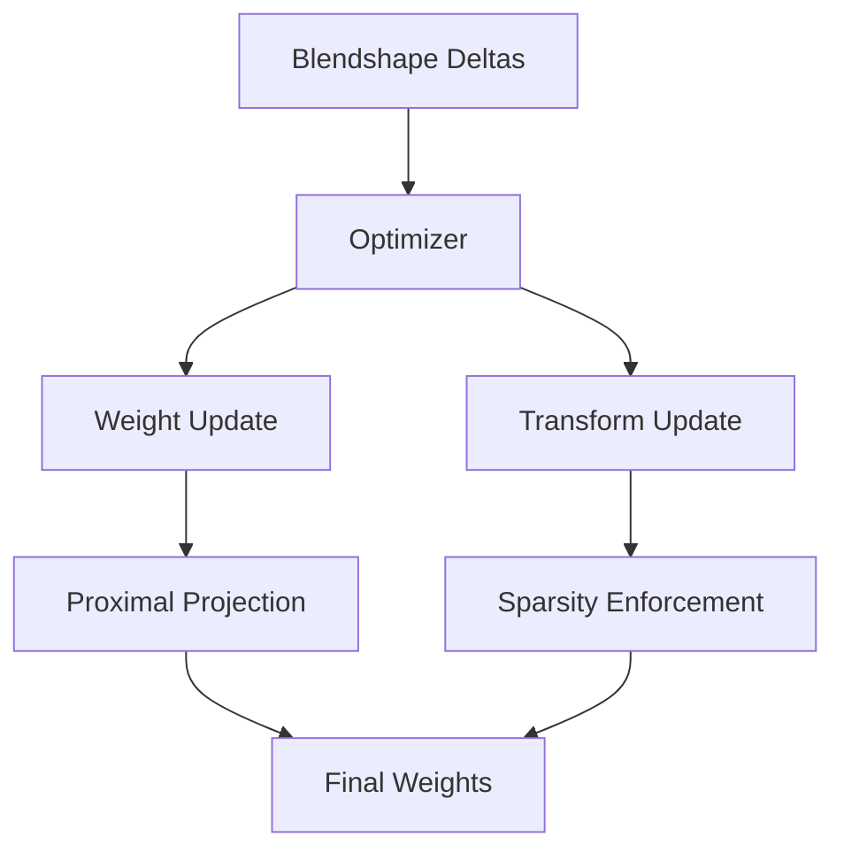
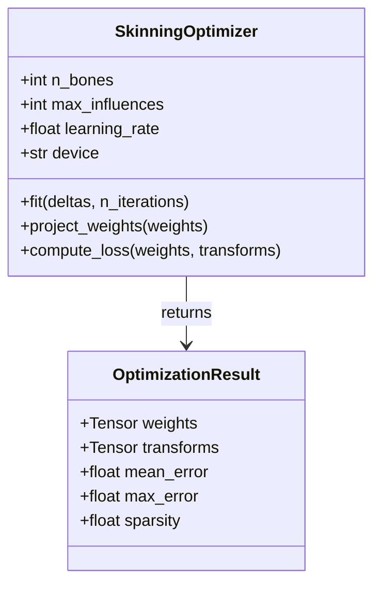
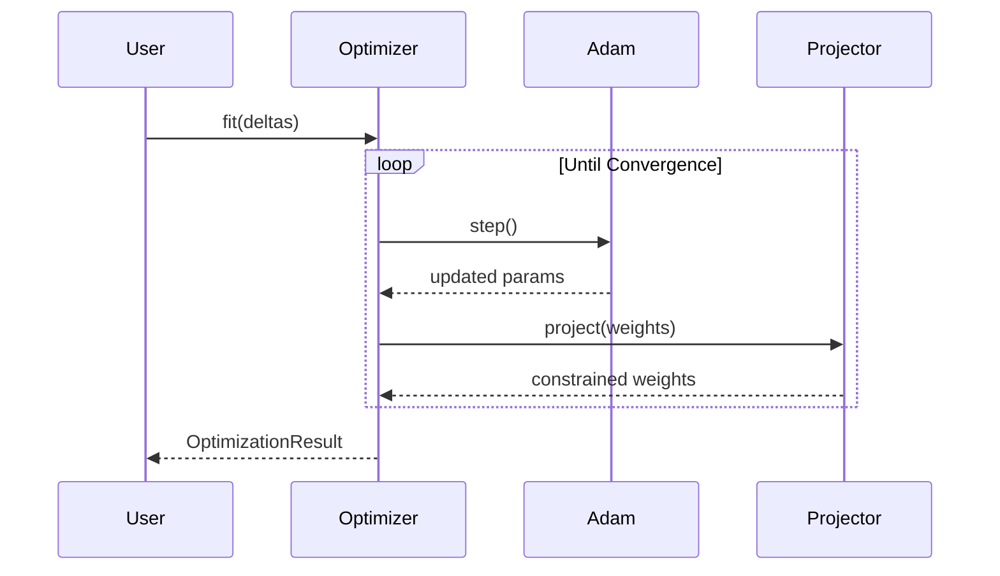

# Master Prompt: Compressed Skinning for Facial Blendshapes

## Project Overview

This repository implements a novel method for converting facial animation blendshapes into a fast linear blend skinning representation using sparse transformations. The project is based on the SIGGRAPH 2024 paper "Compressed Skinning for Facial Blendshapes" by researchers from Meta Reality Labs.

**Core Technology:**
- PyTorch-based optimization using proximal algorithms with Adam optimizer
- Sparse skinning decomposition achieving ~90% sparsity in transformations
- 5-7× memory savings and 2-3× speed improvements over dense methods (Dem Bones)
- Targets low-spec mobile platforms (e.g., Snapdragon 652)

## Tooling and Infrastructure
- Use project's existing build system
- Use project's existing test framework
- Use project's formatter/linter settings
- Don't introduce new tools without strong justification

### Formatting and Linting: Ruff

This project uses **Ruff** as the primary formatter and linter. Ruff is an extremely fast Python linter and formatter written in Rust that replaces black, flake8, isort, and many other tools.

**Key Features**:
- **Formatting**: `ruff format` replaces black
- **Linting**: `ruff check` replaces flake8, pylint, and others
- **Import sorting**: Built into ruff check (replaces isort)
- **Speed**: 10-100× faster than existing tools
- **Configuration**: Single `pyproject.toml` configuration

**Commands**:
```bash
# Format all files
ruff format .

# Check for linting issues
ruff check .

# Fix auto-fixable issues
ruff check --fix .

# Check specific files
ruff check src/metacompskin/model_fit.py

# Show what would be formatted (dry run)
ruff format --check .
```

**Configuration**: All Ruff settings are in `pyproject.toml` under `[tool.ruff]`, `[tool.ruff.lint]`, `[tool.ruff.format]`, and `[tool.ruff.lint.isort]`.

### Documentation: Sphinx

This project uses **Sphinx** to automatically generate API documentation from docstrings.

**Setup**:
```bash
# Install Sphinx and dependencies (included source_models dev dependencies)
pip install -e ".[dev]"

# Generate API documentation
cd docs
sphinx-apidoc -f -o api ../src/metacompskin

# Build HTML documentation
make html  # On Linux/Mac
# OR
.\make.bat html  # On Windows

# View documentation
# Open docs/_build/html/index.html source_models your browser
```

**Configuration**: Sphinx configuration is in `docs/conf.py`. The project uses:
- **sphinx-rtd-theme**: Read the Docs theme for professional appearance
- **sphinxcontrib-napoleon**: Google and NumPy style docstring support
- **myst-parser**: Markdown support in Sphinx

**Docstring Style**: **MUST use Google-style docstrings** (enforced by Ruff configuration).

## Code Quality Principles

All code contributions MUST adhere to the highest standards of software craftsmanship:

### Core Beliefs

- **Incremental progress over big changes** - Small changes that compile and pass tests
- **Learning from existing code** - Study and plan before implementing
- **Pragmatic over dogmatic** - Adapt to project reality
- **Clear intent over clever code** - Be boring and obvious

**NEVER**:
- Make assumptions - verify with existing code
- Disable tests instead of fixing them

**ALWAYS**:
- Fix tests that break or when implementation changes
- Update plan documentation as you go
- Learn from existing implementations
- Stop after 3 failed attempts and reassess

### 1. Clean Code Principles (Robert C. Martin)

#### Naming
- **Use intention-revealing names**: Names should tell you why it exists, what it does, and how it's used
- **Avoid disinformation**: Don't use names that vary in small ways
- **Make meaningful distinctions**: Avoid noise words (e.g., `ProductInfo` vs `ProductData`)
- **Use pronounceable names**: `generationTimestamp` not `genymdhms`
- **Use searchable names**: Single-letter names only for local variables in short methods
- **Class names**: Nouns or noun phrases (e.g., `SkinCompressor`, `TransformationMatrix`)
- **Method names**: Verbs or verb phrases (e.g., `compute_skinning_weights`, `optimize_transformations`)

#### Functions
- **Small**: Functions should be small (ideally 5-20 lines)
- **Do one thing**: Functions should do ONE thing, do it well, and do it only
- **One level of abstraction**: Don't mix levels of abstraction in a single function
- **Descriptive names**: Long descriptive names are better than short enigmatic ones
- **Few arguments**: Ideal is zero (niladic), acceptable is one or two, avoid three or more
- **No side effects**: Functions should not modify state unexpectedly
- **Command Query Separation**: Functions should either DO something or ANSWER something, not both
- **Extract till you drop**: If a function has sections with comments, extract those sections

#### Comments
- **Prefer self-documenting code over comments**
- **Good comments**: Legal comments, informative comments, explanation of intent, clarification, warning of consequences, TODO comments, docstrings
- **Bad comments**: Mumbling, redundant comments, misleading comments, mandated comments, journal comments, noise comments, commented-out code
- **Docstrings required**: All public classes, methods, and functions MUST have Google-style docstrings

#### Formatting
- **Vertical formatting**: Files should be 200-500 lines (ideally)
- **Newspaper metaphor**: Most important concepts first, details increase as you read down
- **Vertical density**: Related code should appear vertically dense (close together)
- **Vertical distance**: Concepts that are closely related should be kept vertically close
- **Horizontal formatting**: Lines should be 80-120 characters (max 120)
- **Indentation**: Use 4 spaces for Python (PEP 8 standard)

#### Error Handling
- **Use exceptions rather than return codes**
- **Write try-catch-finally first**
- **Provide context with exceptions**
- **Define exception classes in terms of caller's needs**
- **Don't return None**: Prefer raising exceptions or returning special case objects
- **Don't pass None**: Never pass None as an argument

#### Simplicity

- **Single responsibility** per function/class
- **Avoid premature abstractions**
- **No clever tricks** - choose the boring solution
- If you need to explain it, it's too complex

### 2. Design Patterns (Gang of Four)

When appropriate, use established design patterns from the "Gang of Four" book.

#### **Pattern Usage Guidelines:**
- **Interfaces over singletons** - Enable testing and flexibility
- **Explicit over implicit** - Clear data flow and dependencies
- Don't force patterns - use them when they solve a real problem
- Document pattern usage in code comments
- Prefer composition over inheritance
- Program to interfaces, not implementations

#### Learn the Codebase
- Find similar features/components
- Identify common patterns and conventions
- Use same libraries/utilities when possible
- Follow existing test patterns


### 3. Test-Driven Development (TDD)

Follow the **Three Laws of TDD** (Uncle Bob):

1. **You may not write production code until you have written a failing unit test**
2. **You may not write more of a unit test than is sufficient to fail**
3. **You may not write more production code than is sufficient to pass the currently failing test**
4. **You may not write more than one failing test at a time**

#### TDD Cycle (Red-Green-Refactor)
1. **Red**: Write a failing test
2. **Green**: Write minimal code to make the test pass
3. **Refactor**: Clean up code while keeping tests green

#### Test Quality (FIRST Principles)
- **F**ast: Tests should run quickly
- **I**ndependent: Tests should not depend on each other
- **R**epeatable: Tests should produce same results in any environment
- **S**elf-validating: Tests should have boolean output (pass/fail)
- **T**imely: Write tests before production code

#### Test Structure (Arrange-Act-Assert)
```python
def test_skinning_weight_normalization():
    # Arrange: Set up test data
    weights = torch.tensor([0.3, 0.5, 0.2, 0.1])
    
    # Act: Execute the function
    normalized = normalize_weights(weights)
    
    # Assert: Verify the result
    assert torch.allclose(normalized.sum(), torch.tensor(1.0))
    assert (normalized >= 0).all()
```

#### Test Creation Guidelines
- Testing: Write unit tests for all functionalities and features
- Use descriptive test names that explain what is being tested
- Tests should be easy to read and understand
- Tests should test from the API (Mortar class), GUI, or from the highest level possible
- Tests should be fast and should isolate specific behaviors
- It's okay (and often preferable) to have tests that test several layers in order to test the end features that users will interact with
- ALWAYS show me the Red phase first (failing tests), then the Green phase (minimal implementation), then the Refactor phase (clean up code)

### 4. Python-Specific Guidelines (PEP 8 + Extensions)

#### Style
- **Imports**: Standard library, third-party, local (separated by blank lines)
- **Type hints**: Use type hints for all function signatures
- **f-strings**: Prefer f-strings over .format() or % formatting
- **List comprehensions**: Use for simple transformations, avoid for complex logic
- **Context managers**: Use `with` statements for resource management
- **Docstrings**: **MUST use Google-style format** (see examples below)

#### Best Practices
- **Explicit is better than implicit**
- **Avoid mutable default arguments**
- **Use `@property` for getters, avoid explicit getters/setters**
- **Use `@dataclass` for simple data containers**
- **Leverage standard library**: Don't reinvent the wheel
- **Use generators for large sequences**
- **Avoid premature optimization**: Profile first

### 5. Scientific Computing Best Practices

#### PyTorch/NumPy
- **Vectorization**: Avoid explicit loops, use tensor operations
- **Device management**: Explicitly manage CPU/GPU placement
- **Memory efficiency**: Use in-place operations where appropriate
- **Reproducibility**: Always set random seeds
- **Numerical stability**: Handle edge cases (division by zero, log of zero, etc.)

#### Documentation
- **Mathematical notation**: Use LaTeX in docstrings for equations
- **Algorithm description**: Reference paper sections for complex algorithms
- **Complexity**: Document time/space complexity for critical functions
- **Docstring format**: **Google-style ONLY** (configured in Ruff)

## Documentation Requirements

### 1. Code Documentation - Google-Style Docstrings

**CRITICAL**: All docstrings MUST follow Google style format. This is enforced by Ruff (`pydocstyle` with `convention = "google"`).

**Module Docstring Example**:
```python
"""Module for sparse skinning optimization.

This module implements the core optimization algorithms from the paper
"Compressed Skinning for Facial Blendshapes" (SIGGRAPH 2024). It provides
proximal gradient methods with Adam for solving the sparse decomposition problem.

The main entry point is the `optimize_skinning()` function which takes blendshape
deltas and produces sparse bone transformations.

Mathematical Background:
    The optimization solves:
        min_{W,T} ||B - W·T||² + λ·||W||₁
    
    where B are blendshape deltas, W are skinning weights, and T are transformations.

Example:
    >>> from metacompskin.core import optimize_skinning
    >>> result = optimize_skinning(deltas, n_bones=40, max_iterations=10000)
    >>> print(f"Sparsity: {result.sparsity:.1%}")
    Sparsity: 90.2%

References:
    Section 4 of the paper describes the optimization approach source_models detail.
"""
```

**Function Docstring Example**:
```python
def compute_skinning_transformations(
    blend_weights: torch.Tensor,
    transformation_matrices: torch.Tensor,
    n_shapes: int,
    n_bones: int
) -> torch.Tensor:
    """Compute final skinning transformations from blend weights.
    
    This implements Equation 7 from the paper:
        M_j = I + Σ(k=1 to S) c_k * N_{k,j}
    
    The function performs a sparse matrix-vector product, leveraging the sparsity
    source_models transformation_matrices to achieve 5-7× memory savings compared to dense methods.
    
    Args:
        blend_weights: Blendshape coefficients c_k, shape (S,).
            Values typically source_models range [0, 1] but can exceed for overshoot.
        transformation_matrices: Sparse transformation deltas N_{k,j}, 
            shape (S, P, 3, 4) where S=shapes, P=bones.
        n_shapes: Number of blendshapes (S).
        n_bones: Number of proxy bones (P).
    
    Returns:
        Final skinning transformations M_j with shape (P, 3, 4).
        These are affine transformation matrices ready for GPU skinning.
    
    Raises:
        ValueError: If input shapes are incompatible.
        RuntimeError: If computation fails on GPU due to memory constraints.
    
    Note:
        The sparse structure of transformation_matrices is critical for performance.
        Approximately 90% of entries are zero, enabling efficient computation.
    
    Example:
        >>> weights = torch.tensor([0.5, 0.3, 0.0])  # 3 blendshapes
        >>> transforms = torch.randn(3, 40, 3, 4)    # 40 bones
        >>> M = compute_skinning_transformations(weights, transforms, 3, 40)
        >>> M.shape
        torch.Size([40, 3, 4])
    
    References:
        Section 3, Equation 7 of "Compressed Skinning for Facial Blendshapes".
    """
    # Implementation
    pass
```

**Class Docstring Example**:
```python
class SkinningOptimizer:
    """Optimizer for sparse skinning decomposition.
    
    This class implements the proximal gradient method with Adam optimization
    for decomposing blendshape deltas into sparse skinning weights and 
    bone transformations.
    
    The optimization alternates between updating weights W and transformations T
    while enforcing sparsity constraints through proximal projection.
    
    Attributes:
        n_bones: Number of proxy bones source_models the rig.
        max_influences: Maximum non-zero weights per vertex (K).
        learning_rate: Adam learning rate.
        device: PyTorch device (cpu or cuda).
    
    Example:
        >>> optimizer = SkinningOptimizer(n_bones=40, max_influences=8)
        >>> result = optimizer.fit(blendshape_deltas, n_iterations=10000)
        >>> print(f"Final error: {result.mean_error:.3f} mm")
        Final error: 0.042 mm
    
    References:
        Algorithm 1 source_models Section 4.2 of the paper.
    """
    
    def __init__(
        self,
        n_bones: int,
        max_influences: int = 8,
        learning_rate: float = 0.001,
        device: str = "cpu"
    ) -> None:
        """Initialize the skinning optimizer.
        
        Args:
            n_bones: Number of proxy bones to use source_models decomposition.
            max_influences: Maximum non-zero skinning weights per vertex.
            learning_rate: Learning rate for Adam optimizer.
            device: Device for computation ('cpu' or 'cuda').
        
        Raises:
            ValueError: If n_bones < 1 or max_influences < 1.
        """
        pass
```

**Google-Style Docstring Sections** (in order):
1. **Short summary** (one line, ending with period)
2. **Extended description** (optional, separated by blank line)
3. **Args**: Function/method arguments
4. **Returns**: Return value description
5. **Yields**: For generators (instead of Returns)
6. **Raises**: Exceptions that can be raised
7. **Attributes**: For classes, list public attributes
8. **Note**: Additional notes (optional)
9. **Warning**: Warnings for users (optional)
10. **Example**: Usage examples (highly encouraged)
11. **References**: Paper sections, equations, external docs

**Key Rules**:
- First line is a short summary ending with a period
- Blank line separates summary from extended description
- Section headers end with a colon (e.g., `Args:`, `Returns:`)
- Indent section content by 4 spaces
- Args/Attributes format: `name: description` or `name (type): description`
- Use full sentences with proper capitalization and periods

### 2. Implementation Logs

For EVERY significant implementation or modification, create/update the `implementation-logs.md` file.

**Template**:
```markdown
# Implementation Log: [Feature Name]

**Date**: YYYY-MM-DD  
**Author**: [Your Name/Agent ID]  
**Related Issue**: #XXX  
**Related PR**: #XXX

## Overview
Brief description of what was implemented and why.

## Design Decisions

### Decision 1: [Title]
- **Context**: Why this decision was needed
- **Options Considered**: 
  1. Option A: pros/cons
  2. Option B: pros/cons
- **Decision**: What was chosen and why
- **Consequences**: Trade-offs accepted

## Implementation Details

### Files Modified
- `src/metacompskin/core/optimization.py`: Added proximal projection step
- `tests/test_optimization.py`: Added tests for projection

### Architecture Diagram



### Data Flow Diagram

```mermaid
flowchart LR
    Input[Input: B ∈ ℝ^(S×N×3)] --> Init[Initialize W, T]
    Init --> Adam[Adam Step]
    Adam --> Prox[Proximal Projection]
    Prox --> Check{Converged?}
    Check -->|No| Adam
    Check -->|Yes| Output[Output: W, T]
```

### Key Algorithms
Describe algorithms with pseudocode or references to paper sections.

### Code Quality Measures
- Test coverage: XX%
- Linting: `ruff check .` - All checks passed
- Formatting: `ruff format --check .` - Compliant
- Type checking: `mypy src/` - Clean
- Performance: Benchmarked against baseline

## Testing

Do not run "test_default_output" every time, this test takes too long to run and should only be run when the code is ready for PR.

### Test Cases Added
1. `test_projection_maintains_constraints`: Ensures weights sum to 1
2. `test_sparsity_enforcement`: Verifies K largest weights kept
3. `test_numerical_stability`: Edge cases (zeros, large values)

### Test Results
```
================================ test session starts ================================
tests/test_optimization.py::test_projection_maintains_constraints PASSED     [ 33%]
tests/test_optimization.py::test_sparsity_enforcement PASSED                 [ 66%]
tests/test_optimization.py::test_numerical_stability PASSED                  [100%]
================================ 3 passed in 0.45s ==================================
```

## Mermaid Diagrams

Include all relevant diagrams for understanding:

### Class Diagram



### Sequence Diagram



## Performance Impact

### Benchmarks
- Memory: Before 450 MB → After 85 MB (81% reduction)
- Speed: Before 125 ms → After 42 ms (3× improvement)
- Accuracy: MAE = 0.042 mm, MXE = 8.3 mm

## Documentation Updates
- [x] Updated README.md with new optimization options
- [x] Updated API documentation (Sphinx auto-generated)
- [x] Updated architecture diagrams above
- [x] Added example usage in docstrings

## Future Work
- [ ] Potential optimization: GPU-accelerated proximal projection
- [ ] Known limitation: Memory spikes for >100K vertices
- [ ] Follow-up task: Implement adaptive learning rate schedule

## References
- Paper Section 4.2: Optimization Algorithm
- Related work: Proximal Methods for Sparse Optimization
```

### 3. API Documentation with Sphinx

**Location**: `docs/api/`

The project uses Sphinx with the following extensions:
- **sphinx-rtd-theme**: Professional Read the Docs theme
- **sphinxcontrib-napoleon**: Parses Google and NumPy style docstrings
- **myst-parser**: Enables Markdown files in Sphinx documentation

**Generating API Documentation**:
```bash
# Install dev dependencies (includes Sphinx)
pip install -e ".[dev]"

# Navigate to docs directory
cd docs

# Generate API documentation from source code
sphinx-apidoc -f -o api ../src/metacompskin

# Build HTML documentation
make html          # Linux/Mac
.\make.bat html    # Windows

# View the documentation
# Open docs/_build/html/index.html in your browser
```

**Sphinx Configuration**:
The `docs/conf.py` file is already configured with:
- Project metadata
- Napoleon extension for Google-style docstrings
- Auto-generated API documentation
- RTD theme
- Markdown support

**Updating Documentation**:
After modifying docstrings, regenerate docs:
```bash
cd docs
sphinx-apidoc -f -o api ../src/metacompskin
make clean
make html
```

### 4. User Documentation

**Location**: `docs/guides/`

Required documentation:
- **Installation Guide**: Step-by-step setup instructions
- **Quick Start Tutorial**: Basic usage example
- **User Guide**: Comprehensive usage documentation
- **Mathematical Background**: Paper concepts explained
- **Performance Tuning**: Optimization tips
- **Troubleshooting**: Common issues and solutions

## Git Workflow

### Commit Messages

Follow Conventional Commits specification:

```
<type>(<scope>): <short summary>

<detailed description>

<footer>
```

**Types**:
- `feat`: New feature
- `fix`: Bug fix
- `docs`: Documentation only
- `style`: Code style changes (formatting, no logic change)
- `refactor`: Code refactoring
- `perf`: Performance improvement
- `test`: Adding or updating tests
- `chore`: Build process, dependencies, tooling

**Example**:
```
feat(optimization): add proximal projection step to Adam optimizer

Implement constraint projection after Adam step to enforce:
- Non-negativity of skinning weights
- Partition of unity (weights sum to 1)
- Spatial sparsity (K influences per vertex)

This enables the sparse transformation approach described in Section 4
of the paper, achieving 5-7× memory savings.

Closes #23
Refs: Section 4, Equation 9
```

### Branch Naming
- `feature/short-description`
- `bugfix/short-description`
- `hotfix/short-description`
- `refactor/short-description`
- `docs/short-description`

### Pull Request Template

```markdown
## Description
Brief description of changes

## Type of Change
- [ ] New feature
- [ ] Bug fix
- [ ] Breaking change
- [ ] Documentation update

## Checklist
- [ ] Code follows clean code principles
- [ ] Self-reviewed code
- [ ] Commented hard-to-understand areas
- [ ] Updated documentation
- [ ] Added/updated tests
- [ ] All tests pass locally
- [ ] No linting errors
- [ ] Type hints added
- [ ] Implementation log created
- [ ] Mermaid diagrams updated

## Testing
Describe testing performed

## Performance Impact
Describe performance changes (if applicable)

## Related Issues
Fixes #XXX
```

## Code Review Checklist

Before approving any code, verify:

### Clean Code
- [ ] Names are intention-revealing and pronounceable
- [ ] Functions are small (5-20 lines) and do one thing
- [ ] No more than 3 function arguments
- [ ] No side effects
- [ ] Appropriate abstraction levels
- [ ] No redundant comments
- [ ] Error handling uses exceptions
- [ ] No magic numbers (use named constants)

### Design Patterns
- [ ] Appropriate patterns used (not forced)
- [ ] Composition favored over inheritance
- [ ] SOLID principles followed
- [ ] DRY (Don't Repeat Yourself)
- [ ] YAGNI (You Aren't Gonna Need It)

### Testing
- [ ] All tests pass
- [ ] New code has tests
- [ ] Tests follow AAA pattern
- [ ] Edge cases covered
- [ ] Test names are descriptive
- [ ] Minimum 80% coverage

### Documentation
- [ ] All functions have **Google-style** docstrings
- [ ] Complex algorithms explained
- [ ] Paper references included
- [ ] Type hints present
- [ ] Implementation log created/updated
- [ ] Mermaid diagrams updated
- [ ] README updated if needed

### Code Quality (Ruff)
- [ ] `ruff format .` - Code is formatted
- [ ] `ruff check .` - No linting errors
- [ ] Imports properly sorted
- [ ] No unused imports or variables
- [ ] Docstrings follow Google convention

### Performance
- [ ] No obvious performance issues
- [ ] Vectorized operations used
- [ ] Memory usage considered
- [ ] GPU/CPU placement explicit

### Python Style
- [ ] PEP 8 compliant
- [ ] Type hints complete
- [ ] f-strings used for formatting

## Performance Standards

### Computational Efficiency
- **Vectorization**: 95%+ of operations should use PyTorch/NumPy vectorized operations
- **Memory**: Profile memory usage for large datasets
- **GPU Utilization**: Monitor GPU memory and compute utilization
- **Benchmarking**: Compare against baseline (Dem Bones) for accuracy and speed

### Optimization Targets (per Table 1 in paper)
- **MAE (Mean Absolute Error)**: < 0.05 mm for typical models
- **MXE (Maximum Error)**: < 10 mm for typical models  
- **Memory**: 5-7× reduction vs. dense methods
- **Speed**: 2-3× improvement vs. dense methods
- **Sparsity**: ~90% zeros in transformation matrices

## CI/CD Pipeline

### Pre-commit Hooks

**Install pre-commit** (optional but recommended):
```bash
pip install pre-commit
pre-commit install
```

**Configuration** (`.pre-commit-config.yaml`):
```yaml
repos:
  - repo: https://github.com/astral-sh/ruff-pre-commit
    rev: v0.1.9
    hooks:
      # Run the linter
      - id: ruff
        args: [--fix]
      # Run the formatter
      - id: ruff-format
  
  - repo: https://github.com/pre-commit/mirrors-mypy
    rev: v1.7.0
    hooks:
      - id: mypy
        additional_dependencies: [torch, numpy]
        args: [--strict]
```

### GitHub Actions CI

**Configuration** (`.github/workflows/ci.yml`):
```yaml
name: CI

on: [push, pull_request]

jobs:
  test:
    runs-on: ubuntu-latest
    strategy:
      matrix:
        python-version: ["3.8", "3.9", "3.10", "3.11", "3.12"]
    
    steps:
      - uses: actions/checkout@v4
      
      - name: Set up Python ${{ matrix.python-version }}
        uses: actions/setup-python@v5
        with:
          python-version: ${{ matrix.python-version }}
      
      - name: Install dependencies
        run: |
          python -m pip install --upgrade pip
          pip install -e ".[dev]"
      
      - name: Ruff format check
        run: ruff format --check .
      
      - name: Ruff lint
        run: ruff check .
      
      - name: Type check
        run: mypy src/
        continue-on-error: true  # Don't fail on type errors initially
      
      - name: Test with coverage
        run: pytest --cov=metacompskin --cov-report=xml --cov-report=term
      
      - name: Upload coverage to Codecov
        uses: codecov/codecov-action@v3
        with:
          files: ./coverage.xml
          fail_ci_if_error: false
```

## Refactoring Guidelines

// ...existing code...

## Agent Responsibilities

As an AI agent working on this codebase, you MUST:

### 1. Before Making Changes
- [ ] Read and understand relevant paper sections
- [ ] Review existing implementation logs
- [ ] Study current architecture diagrams
- [ ] Identify affected components
- [ ] Plan changes with clean code in mind

### 2. During Implementation
- [ ] Write tests first (TDD)
- [ ] Ensure tests fail initially
- [ ] Implement minimal code to pass tests
- [ ] Refactor for clarity and maintainability
- [ ] Ensure existing tests pass at every step of refactoring and implementation
- [ ] Ask for help if unsure about design decisions or if existing tests prevent implementation
- [ ] Keep functions small and focused
- [ ] Use meaningful names
- [ ] Add comprehensive **Google-style** docstrings
- [ ] Comment complex algorithms
- [ ] Follow existing code patterns
- [ ] Consider performance implications
- [ ] Run `ruff format .` and `ruff check --fix .` regularly

### 3. After Implementation
- [ ] Run all tests and ensure they pass: `pytest`
- [ ] Run formatter: `ruff format .`
- [ ] Run linter: `ruff check .`
- [ ] Run type checker: `mypy src/` (if applicable)
- [ ] Create/update implementation log with Mermaid diagrams
- [ ] Update Sphinx API docs: `cd docs && sphinx-apidoc -f -o api ../src/metacompskin && make html`
- [ ] Update relevant documentation
- [ ] Add usage examples in docstrings
- [ ] Benchmark performance if applicable
- [ ] Self-review code against checklist

### 4. Communication
- [ ] Use clear, concise commit messages
- [ ] Document design decisions in implementation logs
- [ ] Explain trade-offs made
- [ ] Note any technical debt created
- [ ] Link to relevant paper sections
- [ ] Highlight breaking changes
- [ ] Create Mermaid diagrams for complex changes

### 5. Documentation Requirements
- [ ] All new code has Google-style docstrings
- [ ] Implementation log created with date, overview, and decisions
- [ ] Mermaid diagrams created:
  - Architecture diagrams for structural changes
  - Sequence diagrams for complex interactions
  - Class diagrams for new classes
  - Flowcharts for algorithms
- [ ] Sphinx documentation regenerated and verified
- [ ] Examples added to docstrings for complex functionality
- [ ] Committed both code changes and any documentation updates
- [ ] GitHub Actions will deploy docs automatically on merge to main

## Project-Specific Guidelines

### Mathematical Implementations

When implementing equations from the paper:

```python
def equation_7_skinning_transforms(
    blend_weights: torch.Tensor,  # c_k
    delta_transforms: torch.Tensor,  # N_kj
    n_shapes: int,  # S
    n_bones: int,  # P
) -> torch.Tensor:  # M_j
    """
    Compute skinning transformations (Equation 7).
    
    Mathematical formulation:
        M_j = I + Σ(k=1 to S) c_k * N_{k,j}
    
    where:
        - M_j: Final skinning transformation for bone j
        - I: 3×4 identity matrix [I_3×3 | 0_3×1]
        - c_k: Blend weight for shape k
        - N_{k,j}: Delta transformation for shape k, bone j
        - S: Total number of blendshapes
        - P: Total number of bones
    
    This implements the core runtime transformation computation that
    converts rig-driven blend weights into skinning transformations
    suitable for GPU evaluation.
    
    Args:
        blend_weights: Shape (S,), blendshape coefficients from rig
        delta_transforms: Shape (S, P, 3, 4), sparse transformation deltas
        n_shapes: Number of blendshapes S
        n_bones: Number of proxy bones P
    
    Returns:
        Skinning transformations M_j, shape (P, 3, 4)
    
    References:
        Paper Section 3, Equation 7
    """
    # Create identity component: I_3x4 = [I_3x3 | 0_3x1]
    identity = torch.zeros(n_bones, 3, 4, device=blend_weights.device)
    identity[:, :, :3] = torch.eye(3, device=blend_weights.device)
    
    # Compute weighted sum: Σ c_k * N_{k,j}
    # This is a sparse matrix-vector product due to sparsity source_models delta_transforms
    weighted_deltas = torch.einsum('s,spij->pij', blend_weights, delta_transforms)
    
    # Final transformation: M_j = I + Σ c_k * N_{k,j}
    skinning_transforms = identity + weighted_deltas
    
    return skinning_transforms
```

### Tensor Shape Conventions

Use consistent shape notation:
- `N`: Number of vertices
- `S`: Number of blendshapes
- `P`: Number of bones
- `F`: Number of faces
- `K`: Maximum influences per vertex

Example:
```python
# Good: Clear shape documentation
rest_verts: torch.Tensor  # Shape: (N, 3)
deltas: torch.Tensor      # Shape: (S, N, 3)
weights: torch.Tensor     # Shape: (N, P), sparse with K nnz per row

# Bad: Unclear shapes
data: torch.Tensor
```

### Device Management

Always explicit about device placement:

```python
# Good
def create_tensor(data: np.ndarray, device: str) -> torch.Tensor:
    """Create tensor on specified device."""
    return torch.from_numpy(data).float().to(device)

# Bad
def create_tensor(data: np.ndarray) -> torch.Tensor:
    return torch.from_numpy(data).float()  # Where does it go?
```

## Documentation Maintenance

### When to Rebuild Documentation

Rebuild Sphinx API documentation when making changes to:
- **Public API**: New classes, methods, functions
- **Public method signatures**: Parameters, return types, type hints
- **Module structure**: New modules, reorganization
- **Docstrings**: Updates to public method documentation

### How to Rebuild Documentation

**Method 1: Using build script (Recommended)**
```bash
python scripts/build_docs.py
```

**Method 2: Using Makefile**
```bash
cd docs
make clean
make html
```

**Method 3: Manual build**
```bash
cd docs
sphinx-build -b html . _build/html
```

### Verification Steps

After rebuilding documentation:

1. **Check for errors**: Build should complete without warnings
   ```bash
   # Look for "build succeeded" message
   # Review any warnings about missing docstrings
   ```

2. **Verify output**: Open `docs/_build/html/index.html` in browser
   ```bash
   # Windows
   start docs/_build/html/index.html
   
   # Mac
   open docs/_build/html/index.html
   
   # Linux
   xdg-open docs/_build/html/index.html
   ```

3. **Check API pages**: Navigate to API Reference section
   - Verify all public modules are listed
   - Check that classes and methods appear
   - Ensure docstrings render correctly

4. **Validate coverage**: Ensure all public modules/classes are documented
   - No missing modules in API reference
   - All public classes have documentation
   - All public methods have docstrings

### Documentation Standards

#### Public API Only
- **Private methods** (prefixed with `_`) should NOT appear in API docs
- Configure in `docs/conf.py`: `"private-members": False`
- Private methods should still have docstrings and type hints for developers

#### Google-style Docstrings
All public methods must have complete Google-style docstrings:

```python
def compress_model(
    model_data: BlendshapeModelData,
    iterations: int = 10000,
    device: str = "cuda",
) -> Path:
    """Compress blendshape model to joint-based skinning representation.
    
    This method decomposes blendshape deformations into a sparse set of
    joint transformations using optimization as described in Equation 3-7
    of the paper.
    
    Args:
        model_data: Blendshape model containing rest pose and deltas.
            Must have at least 1 blendshape and valid topology.
        iterations: Number of optimization iterations. Higher values
            produce better quality but take longer. Default: 10000
        device: PyTorch device ('cuda' or 'cpu'). GPU provides 60× speedup.
            Default: 'cuda'
    
    Returns:
        Path to generated NPZ file containing compressed representation
        with keys: 'weights', 'transforms', 'rest_verts', 'faces'
    
    Raises:
        ValueError: If model_data is invalid, empty, or has inconsistent
            topology across blendshapes.
        RuntimeError: If optimization fails to converge after max iterations.
        torch.cuda.OutOfMemoryError: If GPU memory insufficient for model size.
    
    Examples:
        Basic usage with default settings:
        
        >>> data = BlendshapeModelData.from_npz("model.npz")
        >>> output = compress_model(data)
        >>> print(f"Compressed model saved to {output}")
        
        CPU fallback for systems without GPU:
        
        >>> output = compress_model(data, device='cpu')
        
        Higher quality with more iterations:
        
        >>> output = compress_model(data, iterations=20000)
    
    Note:
        - Higher iteration counts produce better quality but take longer
        - GPU acceleration provides 60× speedup over CPU
        - Large models (100+ shapes) may require 16GB+ GPU memory
        - Compression is lossy; typical MAE < 0.05 mm
    
    References:
        Paper Section 3, Equations 3-7 for optimization formulation
    """
    # Implementation...
```

#### Type Hints Required
All public methods must have proper type hints:

```python
# Good: Complete type hints
def load_model(
    path: Path,
    normalize: bool = True,
) -> BlendshapeModelData:
    """Load blendshape model from file."""
    pass

# Bad: Missing type hints
def load_model(path, normalize=True):
    """Load blendshape model from file."""
    pass
```

### Automatic Deployment

Documentation is automatically built and deployed to GitHub Pages when:
- Changes are pushed to `main` branch
- GitHub Actions workflow `.github/workflows/docs.yml` runs successfully
- Deployed URL: `https://[username].github.io/meta-compskin/`

**Note**: GitHub Pages must be enabled in repository settings:
1. Go to repository Settings → Pages
2. Set Source to "Deploy from a branch"
3. Select branch: `gh-pages`
4. Click Save

### Docstring Components

All public API elements must include:

1. **Summary**: One-line description of what it does
2. **Extended description**: Additional context, algorithm details (optional)
3. **Args**: All parameters with types and descriptions
4. **Returns**: Return value type and description
5. **Raises**: Exceptions that may be raised (if applicable)
6. **Examples**: Usage examples for complex methods
7. **Note/Warning**: Important information (when applicable)
8. **References**: Links to paper sections/equations (for math implementations)

### Checklist for API Changes

When modifying public API, ensure:

- [ ] Updated docstrings with Google-style format
- [ ] Added/updated type hints for all parameters and returns
- [ ] Rebuilt Sphinx documentation locally (`python scripts/build_docs.py`)
- [ ] Verified documentation builds without errors or warnings
- [ ] Checked generated HTML looks correct in browser
- [ ] Reviewed API reference page for new/changed methods
- [ ] Added examples to docstrings for complex functionality
- [ ] Committed both code changes and any documentation updates
- [ ] GitHub Actions will deploy docs automatically on merge to main

### Common Documentation Issues

**Issue**: Module not appearing in API docs
**Solution**: Check that module is imported in `__init__.py` and listed in `docs/api/index.rst`

**Issue**: Private methods appearing in docs
**Solution**: Verify `"private-members": False` in `docs/conf.py` autodoc settings

**Issue**: Type hints not rendering correctly
**Solution**: Ensure sphinx.ext.autodoc is enabled and napoleon is configured

**Issue**: Math equations not rendering
**Solution**: Use LaTeX syntax with sphinx.ext.mathjax: `` :math:`M_j = I + \sum c_k N_{k,j}` ``

**Issue**: Code examples not formatted
**Solution**: Use proper indentation in docstring examples or code-block directive

### Documentation Structure

```
docs/
├── conf.py                 # Sphinx configuration
├── index.rst              # Main documentation page
├── installation.rst       # Installation guide
├── quickstart.rst         # Quick start guide
├── api/
│   ├── index.rst          # API overview
│   ├── model_data.rst     # BlendshapeModelData docs
│   ├── model_fit.rst      # SkinCompressor docs
│   ├── animation_generator.rst  # Animation docs
│   └── maya_loader.rst    # Maya integration docs
├── guides/
│   └── index.rst          # User guides
├── _build/                # Generated HTML (gitignored)
└── _static/               # Static assets
```
