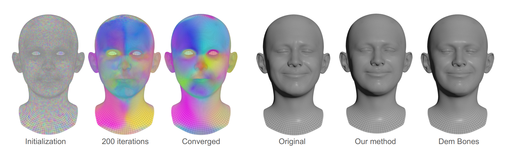
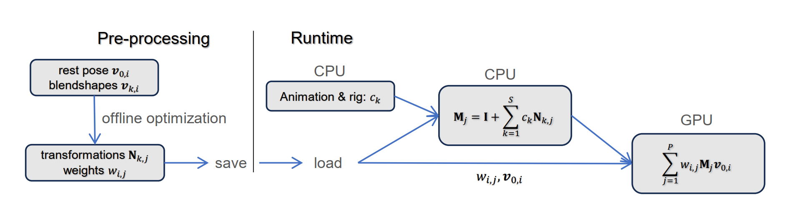
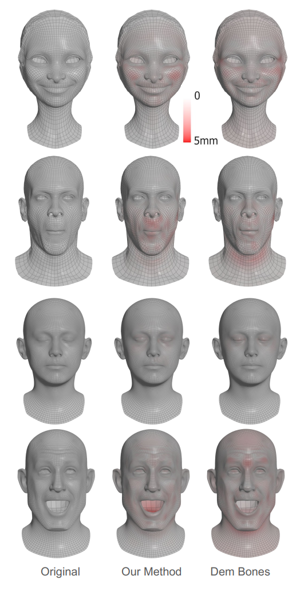
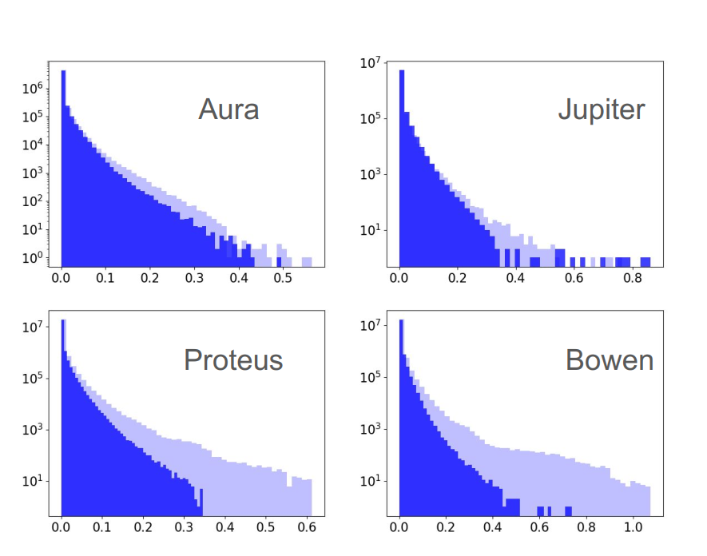

# Compressed Skinning for Facial Blendshapes

* Ladislav Kavan, lkavan@meta.com , Meta , Zürich, Switzerland 
* John Doublestein, jdoublestein@meta.com , Meta , Redmond, USA
* Martin Prazak , map@meta.com , Meta , Zürich, Switzerland
* Matthew Cioffi , mail@mattcioffi.com , Meta , Londonderry, USA
* Doug Roble , droble@acm.org , Meta , Sausalito, USA

> **Figure 1:** Starting from a random initialization of skinning weights, our method converges to a linear
>blend skinning approximation of input blendshapes. The accuracy and visual quality of our results is
>comparable to the state-of-the-art (Dem Bones), but introduces significantly smaller run-time
>overheads. In the figure, each color visualizes the influence of one bone, with 40 bones total.

## ABSTRACT

We present a new method to bake classical facial animation blendshapes
into a fast linear blend skinning representation. Previous
work explored skinning decomposition methods that approximate
general animated meshes using a dense set of bone transformations;
these optimizers typically alternate between optimizing for
the bone transformations and the skinning weights. We depart from
this alternating scheme and propose a new approach based on proximal
algorithms, which effectively means adding a projection step
to the popular Adam optimizer. This approach is very flexible and
allows us to quickly experiment with various additional constraints
and/or loss functions. Specifically, we depart from the classical
skinning paradigms and restrict the transformation coefficients to
contain only about 10% non-zeros, while achieving similar accuracy
and visual quality as the state-of-the-art. The sparse storage enables
our method to deliver significant savings in terms of both memory
and run-time speed. We include a compact implementation of our
new skinning decomposition method in PyTorch, which is easy to
experiment with and modify to related problems.

## CCS CONCEPTS
• Computing methodologies → Animation.

## KEYWORDS
facial animation, blendshapes, skinning decomposition

### ACM Reference Format:
Ladislav Kavan, John Doublestein, Martin Prazak, Matthew Cioffi, and Doug Roble. 2024.
Compressed Skinning for Facial Blendshapes. In Special Interest Group on Computer Graphics and
Interactive Techniques Conference Conference Papers ’24 (SIGGRAPH Conference Papers ’24), July
27-August 1, 2024, Denver, CO, USA. ACM, New York, NY, USA, 9 pages.
https://doi.org/10.1145/3641519.3657477

## 1 - INTRODUCTION

Many people can access interactive graphics only through inexpensive
handheld devices, which is problematic for delivering appealing
animated 3D characters. While cloud compute is one potential solution,
scaling graphics workloads to billions of users would require a
prohibitive amount of compute resources. Therefore, on-device execution
is the most viable path to deliver interactive 3D experiences
to a large user base. Artists working with facial animation and
rigging usually seek maximum creative control and flexibility. This
often leads to the use of a large number of blendshapes. High-end
film rigs use over 1000 blendshapes, and even less detailed stylized
characters still require about 200-300 blendshapes, especially due
to corrective shapes needed to overcome the limitations of linear
blending.

Many data compression algorithms have been studied in the past,
but real-time animation requires adecompression method that is
fast and integrates well with a GPU that performs the final rendering.
Linear blend skinning decomposition methods [James and Twigg 2005]
have been proposed to solve this problem for general
animated meshes and they also work well for facial blendshapes.

Linear blend skinning decomposition departs from the traditional
hierarchical skeleton structures and instead approximates an input
data matrix $\mathbf{A}$ ∈ $\mathbb{R}^{3S \times N}$ as a product of two factors: $\mathbf{A}$ ≈ $\mathbf{BC}$, where
$\mathbf{B}$ ∈ $\mathbb{R}^{3S \times 4P}$, $\mathbf{C}$ ∈ $\mathbb{R}^{4P \times N}$. The input matrix $\mathbf{A}$ contains the x, y, z
coordinates of the 𝑆 input shapes with 𝑁 vertices; the 𝑃 is the
number of proxy-bones. The matrices $\mathbf{B}$ and $\mathbf{C}$ have special 
structure: $\mathbf{B}$ is typically dense and stacks the skinning transformations;
$\mathbf{C}$ is typically sparse and combines the skinning weights with the
rest pose. The problem of “skinning decomposition” can be defined
as finding the factors $\mathbf{B}$ and $\mathbf{C}$ for a given $\mathbf{A}$. The state-of-the-art
method for solving this problem is implemented in the open source
"Dem Bones" library [Electronic Arts [n. d.]; Le and Deng 2012]
which has been integrated in Maya, Houdini and many other tools.
Linear blend skinning is a widely recognized standard in interactive
graphics. By adhering to this standard, we can take advantage of
highly optimized shader implementations, file formats, and tools
that are already in place.

In Dem Bones, as well as in most publications on this problem,
the user has to select a fixed number of proxy-bones. These proxy-bones
do not have any anatomical meaning, but they correspond
to individual skinning transformations; each transformation drives
part of the mesh. With our rigs, we found that as few as 40 proxy-bones
lead to acceptable quality with Dem Bones. However, even
with a modest set of 300 blendshapes, this introduces significant
run-time overheads, because for each of the shapes we need to store
all of the proxy-bone transformations: 300 × 40 = 12000 (with each
individual transformation represented either via a 3 × 4 matrix or a
[quaternion, translation] pair). These transformations have to be
read and blended at run-time for each character, every frame. We
can do better if we revisit the problem of skinning decomposition
from scratch. Previous work explored solvers based on alternating
between optimization for the skinning weights and the transformations
(cyclic coordinate descent). More and more efficient and
general solvers were explored during the 2005 - 2015 decade and
open sourced in 2019 in the Dem Bones library. The need to minimize
the run-time compute requirements lead us to explore an
entirely different optimization strategy, motivated by the success
of first-order optimization methods used in deep learning. This is
not trivial, because typical deep learning optimizers assume unconstrained
optimization and typically handle bounds via sigmoid
or softmax functions. This may be sufficient for non-negativity
and affinity of the skinning weights, but the hard constraint of
spatial sparsity is more difficult. Inspired by proximal algorithms,
well studied in the convex setting [Parikh et al. 2014], we append a
constraint-projection step to the popular Adam optimizer [Kingma and Ba 2014];
this is a key ingredient of our proposed method.

We are solving exactly the same optimization objective (loss) as
previous skinning decomposition methods, including Dem Bones.
However, this objective is highly non-convex and thus different optimization
methods converge to different solutions. Our approach
consistently converges to solutions with lower errors than the Dem
Bones solver. We can even lower the number of proxy-bones to
20 and still obtain similar accuracy as Dem Bones, but we needed
more significant savings. Our key finding to report in this paper
is that we can introduce sparsity constraints also on the transformations,
i.e., zero-out about 90% of the coefficients of $\mathbf{B}$ and still
match the accuracy of the Dem Bone results (this is in addition
to the sparsity of $\mathbf{C}$, i.e., both $\mathbf{B}$ and $\mathbf{C}$ are now sparse). This 
additional sparsification is straightforward to implement as part of
the constraint-projection step. Even when accounting for the overhead
of sparse data structures, this represents significant savings at
runtime. To our knowledge, this additional “skinning transformation
sparsification” has not been explored before and we propose
to name it “compressed skinning” to distinguish it from previous
skinning decomposition methods which compute dense $\mathbf{B}$.

Our strategy of leveraging deep learning optimizers allows for a
compact implementation in PyTorch [Paszke et al. 2019] with automatic
backward differentiation and trivial deployment to CUDA.
There are also additional benefits: previous skinning optimization
methods start with a sophisticated initial guess computed with
spectral or k-means clustering. With our approach, we simply use
the Gaussian noise to initialize all of our variables (Figure 1) – more
complicated initializations were not necessary and can introduce
bias or even lead to worse results (e.g. in the case of symmetries
preserved by the optimizer). Another advantage of our approach
is its flexibility, e.g., changing the loss function is just a simple
one-line code modification. We leveraged this flexibility and tried
improving the accuracy of our fits by changing the error metric
from the classical L2 norm to an Lp norm with higher p. When we
changed the norm to L12 and increased the number of influences to
32, the maximal error dropped by more than 50 times compared to
Dem Bones, allowing us to recover even fine wrinkles in the original
blendshapes, at the cost of more non-zeros weights in matrix $\mathbf{C}$.
However, our main focus is not improvements of quality but rather
run-time efficiency.

Another contribution is a precise formulation of converting th
“blend-weights” (i.e. the time-varying blendshape coefficients) to
linear blend skinning transformations. This problem was not considered
in previous skinning decomposition methods 
[James and Twigg 2005; Le and Deng 2012] which were more general and not
focused on blendshape animation. This conversion is not hard but
also it is not trivial because 1) skinning handles the rest pose differently
than blendshapes and 2) linear blending of transformations is
correct only when using a carefully chosen subset of spatial transformations
(specifically, we use linearized rotations). Our first-order
optimization approach requires longer pre- processing time than
Dem Bones (on the order of minutes on a single GPU), but reduces
the computation footprint on target devices.

Our main technical contributions are:

• New, first-order optimization method that solves skinning decomposition better than previous methods

• New skinning decomposition constraint: sparsity of transformations (“compressed skinning”)

• Explicit formulas to convert facial animation blend-weights into skinning transformations

However, our method is more complex than classical linear blend skinning and drifts away from
established practices, in particular:

• Our method needs an extra sparse matrix-vector multiplication on the CPU to compute skinning
  transformations.

• The GPU skinning shaders need to support arbitrary transformation matrices (rigid transformations are
  not sufficient).

## 2 - BACKGROUND AND RELATED WORK
Traditional facial blendshape models are typically rooted in Facial
Action Coding System [Ekman and Friesen 1978] or its variants
[Lewis et al. 2014], though more recent research aims at addressing their limitations: complex controls and large number of blendshapes needed for high fidelity [Choi et al. 2022; Kim and Singh
2021]. If training data or facial rigs are available, it is possible to
derive more efficient models using classical statistical methods
[Meyer and Anderson 2007] or deep learning [Bailey et al. 2020;
Chandran et al. 2022]. Our approach builds upon deep learning optimizers (Adam), but utilizes only the classical linear blend skinning
model – no neural networks.

The problem of skinning decomposition was introduced by [James
and Twigg 2005] and considered general animation sequences, not
just facial animation, but also e.g. cloth animation or stylized fullbody characters. Subsequent research led to better approximations
of the unknown global optimum [Kavan et al. 2010], studied the
benefits of adding bone rigidity constraints [Kavan et al. 2007; Le
and Deng 2012] and further compression of the skinning weights
via two-layer skinning [Le and Deng 2013]. All of the these methods find a cloud of unstructured proxy-bone transformations. An
alternative approach aims to fit input animations with hierarchical
skeletons [Bharaj et al. 2012; Hasler et al. 2010; Moutafidou et al.
2023; Schaefer and Yuksel 2007] which offers better editability and
compatibility with tools such as Maya with well established support for hierarchical skeletons. Even though hierarchical skeletons
are most commonly used for full-body animation, they can be also
useful in facial animation, e.g. for the jaw and the eyes [Li et al.
2017]. However, high quality jaw opening can be also achieved
without any skeleton using “intermediate” blendshapes [Lewis et al.
2014]. [Seo et al. 2011] studied blendshape compression via hierarchical semi-separable matrices, which finds permutations of the
blendshape matrix and a tree structure eliminating blocks of zeros. This leads to a compact representation, but their method is
closed-source and the decompression algorithm is much more complex than skinning. More recently, GPU-specific methods to speed
up blendshape evaluation using compute shaders were proposed
[Costigan et al. 2016].

Beyond computer graphics, methods such as Lasso [Tibshirani
1996], non-negative matrix factorization [Hoyer 2004; Lee and Seung 1999] and overcomplete dictionary learning [Aharon et al.
2006] discover sparse structures in input data. Compressed sensing
[Donoho 2006] solves underdetermined linear systems by assuming
sparsity. The common theme in these methods are sparsity-inducing
norms. The idea of combining the Adam optimizer with a proximal
operator has been studied for the source separation problems in
astronomical imaging [Melchior et al. 2019]. Each domain (structured data / images / meshes) has its own specifics. In the context
of animated polygon meshes with constant connectivity, a scenario
similar to ours, the 𝐿1 norm has been utilized to transform an input
mesh animation into a blendshape representation [Neumann et al.
2013]. However, our approach differs in that we take blendshapes as
input and convert them into skinning. In other words, our method
could potentially follow [Neumann et al. 2013] or any other method
that generates blendshapes.

### 2.1 Blendshape Facial Models

In this section we briefly recap standard methods for facial blendshape
modeling and establish notation for future sections. The
classical blendshape model [Lewis et al. 2014] uses the following
“delta” formulation centered at the rest-pose (neutral facial expression):

$$
\begin{equation}
\mathbf{\hat{v}}_{0,i} + \sum_{k=1}^{S} c_k (\mathbf{\hat{v}}_{k,i} - \mathbf{\hat{v}}_{0,i}) \tag{1}
\end{equation}
$$

where $\hat{V}_{0,i}$ ∈ $\mathbb{R}^{3}$ is 𝑖-th rest-pose vertex, $\hat{V}_{k,i}$ ∈ $\mathbb{R}^{3}$ is 𝑖-th vertex
in blendshape number $k$ and $c_k$ are blending coefficients. With all
coefficients $c_k$ set to zero, we obtain the rest-pose, typically representing
a neutral facial expression. In a basic linear blendshape
model, all $c_k$ are directly driven by the animator. However, the well-known
limitations of linear blending lead to dissatisfying results for
some combinations of $c_k$ values. To avoid this problem, artists typically
do not modify the $c_k$ coefficients directly, but create a function
known as a “rig” that takes as input a reduced, animator-friendly
set of control values and outputs all of the $c_k$ coefficients. These
controls are typically FACS-based [Ekman and Friesen 1978] and
low-dimensional (about 40 to 80 controls), while the $c_k$ coefficients
are more numerous (200 to 300, or more in film-quality models). The
rig function is typically made from elementary non-linear blocks
supporting intermediate and combination (or “corrective”) shapes.
The details are not important in this paper but are well explained
in the literature [Lewis et al. 2014].

### 2.2 Linear Blend Skinning

Linear blend skinning has been originally developed for smooth
deformations of articulated meshes [Magnenat-Thalmann et al. 1988],
but it is a general deformation model [Jacobson et al. 2011]:

$$
\begin{equation}
\sum_{j=1}^{P} {w}_{i,j} \mathbf{M}_j \mathbf{v}_{0, i} \tag{2}
\end{equation}
$$

where $\mathbf{{v}}_{0, i}$ ∈ $\mathbb{R}^{4}$ is $\mathbf{\hat{v}}_{0,i}$ but with the additional coordinate set to 1;
$\mathbf{M}_j$ ∈ $\mathbb{R}^{3 \times 4}$ are affine transformation matrices, corresponding to
either skeletal bones in full-body animation or virtual proxy-bones
[James and Twigg 2005]; ${w}_{i,j}$ are skinning weights satisfying the
following constraints; non-negativity: ${w}_{i,j}$ ≥ 0, partition of unity:
$\sum_{j}{w}_{i,j}$ = 1 and spatial sparsity: the number of nonzero ${w}_{i,j}$ for
each $i$ is bounded by a constant 𝐾. Eq. 2 transforms only vertex
positions; normals are often approximated but an accurate and
efficient method exists [Tarini et al. 2014].

The transformations $\mathbf{M}_j$ are the only time-varying parameters
in an animation and thus play the same role as the $c_k$ coefficients
in blendshape models (Eq. 1). To convert a blendshape model
to a skinned one, we will need a way to convert $c_k$ into $\mathbf{M}_j$. To our
knowledge, this conversion method has not been presented in the
literature; skinning decomposition papers [James and Twigg 2005;
Le and Deng 2012] assume general animated meshes and provide
only playback functionality – they do not discuss the specifics of
facial models and the combination of blendshapes represented by
skinning transformations.

## 3 - FRAMEWORK

We start by writing down the formula for converting $c_k$ into $\mathbf{M}_j$.
This will also help clarify the framework of our approach and
explain the setup for our new compressed skinning decomposition
algorithm (Sec. 4).

We introduced the problem of skinning decomposition via a succinct
abstraction using matrices $\mathbf{A}$ ∈ $\mathbb{R}^{3S \times N}$, $\mathbf{B}$ ∈ $\mathbb{R}^{3S \times 4P}$ and
$\mathbf{C}$ ∈ $\mathbb{R}^{4P \times N}$. The matrix $\mathbf{A}$ contains $\mathbf{\hat{v}}_{k,i}$ − $\mathbf{\hat{v}}_{0,i}$ and the matrices
$\mathbf{B}$, $\mathbf{C}$ have the following structure:

$$
\mathbf{B} = 
\begin{bmatrix} 
\hat{N}_{1,1} & \hat{N}_{1,2} & \cdots & \hat{N}_{1,P} \\ 
\vdots & \vdots & \ddots & \vdots \\ 
\hat{N}_{S,1} & \hat{N}_{S,2} & \cdots & \hat{N}_{S,P}
\end{bmatrix},
\quad
\mathbf{C} = 
\begin{bmatrix}
w_{1,1}\mathbf{v}_{0,1} & \cdots & w_{N,1}\mathbf{v}_{0,N} \\
\vdots & \ddots & \vdots \\
w_{1,P}\mathbf{v}_{0,1} & \cdots & w_{N,P}\mathbf{v}_{0,N}
\end{bmatrix}
\tag{3}
$$

The matrices $\hat{N}_{k,j} \in \mathbb{R}^{3 \times 4}$ are defined as $\hat{N}_{k,j} = \mathbf{I} + \mathbf{N}_{k,j}$, where $\mathbf{I} \in \mathbb{R}^{3 \times 4}$ is a $3 \times 3$ identity matrix extended with a column of zeros. With this notation, the formula $\mathbf{B}\mathbf{C} = \mathbf{A}$ is equivalent to:

$$
\sum_{j=1}^{P} w_{i,j} (\mathbf{I} + \mathbf{N}_{k,j})\mathbf{v}_{0,i} = \hat{\mathbf{v}}_{k,i} \tag{4}
$$

Due to the fact that $\sum_{j} w_{i,j}\mathbf{I}\mathbf{v}_{0,i} = \hat{\mathbf{v}}_{0,i}$ which follows from the partition of unity of the skinning weights, Eq. 4 is also equivalent to:

$$
\sum_{j=1}^{P} w_{i,j}\mathbf{N}_{k,j}\mathbf{v}_{0,i} = \hat{\mathbf{v}}_{k,i} - \hat{\mathbf{v}}_{0,i} \tag{5}
$$

which shows that the transformations $\mathbf{N}_{k,1}, ... , \mathbf{N}_{k,P}$ represent exactly the $k$-th delta-shape
$\hat{\mathbf{v}}_{k,i} - \hat{\mathbf{v}}_{0,i}$ (Eq. 1). Intuitively, the subtraction of the identities $\mathbf{I}$ corresponds to subtraction of the rest
pose. This is related to the fact that linear blend skinning returns the rest-pose for identity
transformations, while Eq. 1 returns the rest-pose for zero blendweights $c_k$.

Let us now assume that we have solved for $w_{i,j}$ and $\mathbf{N}_{k,j}$ that satisfy Eq. 5 and all of the skinning weight
constraints (this will be discussed in more detail in Sec. 4). Now we just need a formula to compute the
final skinning transformations. This formula can be derived by algebraic manipulations of Eq. 1:

$$
\begin{aligned}
\hat{\mathbf{v}}_{0,i} + \sum_{k=1}^{S} c_k (\hat{\mathbf{v}}_{k,i} - \hat{\mathbf{v}}_{0,i}) &= \hat{\mathbf{v}}_{0,i} + \sum_{k=1}^{S} c_k \sum_{j=1}^{P} w_{i,j}\mathbf{N}_{k,j}\mathbf{v}_{0,i} \\
&= \sum_{j=1}^{P} w_{i,j} \left(\mathbf{I} + \sum_{k=1}^{S} c_k\mathbf{N}_{k,j}\right) \mathbf{v}_{0,i}
\end{aligned}
\tag{6}
$$

Therefore, if we define the final skinning transformations $\mathbf{M}_j$ as:

$$
\mathbf{M}_j = \mathbf{I} + \sum_{k=1}^{S} c_k\mathbf{N}_{k,j} \tag{7}
$$

for $j = 1, ... , P$, the linear blend skinning formula (Eq. 2) produces the exact same result as the blending
of the blendshapes, as shown in Eq. 6.

The flowchart of our method is in Figure 2. A limitation of our
method compared to a standard skinning implementation is the
need to evaluate Eq. 7 on the CPU. In the case of dense $\mathbf{N}_{k,j}$, as
with Dem Bones implementation, this is a dense matrix-vector
product. We propose sparse $\mathbf{N}_{k,j}$ in which case this becomes a sparse
matrix-vector product. In either case, the resulting $\mathbf{M}_j$ are dense
and are passed to a standard skinning shader. In typical character
animation systems, facial animation is usually composited with a
head (or neck) transformations and full-body skinning. This can be
accomplished by multiplying our $\mathbf{M}_j$ with the head transformation
on the CPU, as in standard hierarchical skeletal animation.

In summary, we have converted the delta-blendshape model
(Eq. 1) to linear blend skinning. This conversion is exact only if
Eq. 5 is satisfied exactly; in practice there will be some errors, but
we will minimize them to ensure a visually pleasing approximation
of the original blendshape model. Our key contribution (and the
rationale behind the name "Compressed Skinning") is that most of
our final $\mathbf{N}_{k,j}$ transformations will be zero, enabling us to realize
significant savings compared to dense methods such as Dem Bones.

### 3.1 Transformation representation

The most general choice for $\mathbf{N}_{k,j}$ are general $\mathbb{R}^{3 \times 4}$ matrices, but
some authors proposed restricting the $3 \times 3$ components to rotations
[Le and Deng 2012]. This works well for general animation
sequences which are not driven by delta-blending, but our approach
relies on the linear blending in Eq. 7. Even if we constrained $\mathbf{N}_{k,j}$
to rotations, the resulting $\mathbf{M}_j$ will not be rotations due to Eq. 7.

Therefore, in our final method we chose to use the following class
of transformations:

$$
\mathbf{N}_{k,j} =
\begin{bmatrix}
0 & -r_{k,j,3} & r_{k,j,2} & t_{k,j,1} \\
r_{k,j,3} & 0 & -r_{k,j,1} & t_{k,j,2} \\
-r_{k,j,2} & r_{k,j,1} & 0 & t_{k,j,3}
\end{bmatrix}
\tag{8}
$$

using only three degrees of freedom for the linearized rotation
$(r_{k,j,:})$ [Goldstein et al. 2002] and another three for the translation
$(t_{k,j,:})$. This class of transformations is closed under linear blending,
i.e., linear combination of transformations of the form of Eq. 8
produces another transformation of the same form. This means
that Eq. 7 can work with the 6-dimensional representation in Eq. 8
and compute nothing but plain linear blending at run-time. This is
faster than e.g. quaternion interpolation of rotations, which requires
a projection/normalization step and safeguards to ensure shortest-path
interpolation [Buss and Fillmore 2001]. In our case, linear
blending is correct because the original blendshapes were designed
to be blended linearly (Eq. 1); non-linearities such as jaw opening
are handled in the rig, which we treat as a black box. This is an
efficient approach to convert blendshape models into linear blend
skinning which also lends itself to a well structured code.

> **Figure 2:** The skinning decomposition is pre-computed offline (left). On the end-user device, we first
> load the pre-computed $w_{i,j}$ and $\mathbf{N}_{k,j}$. Then, for each animation frame (runtime, right), we obtain $c_k$ from
> the rig and compute $\mathbf{M}_j$. The skinning transformations $\mathbf{M}_j$ along with the rest-pose $\mathbf{v}_{0,i}$ and weights
> $w_{i,j}$ are passed to linear blend skinning module running on the GPU.

## 4 - COMPRESSED SKINNING DECOMPOSITION

In this section we discuss the details of our skinning decomposition
(Figure 2: pre-processing). This is a non-convex optimization
problem:

$$
\min_{w_{i,j}, \mathbf{N}_{k,j}} \sum_{i=1}^N \sum_{k=1}^S (E_{i,k})^p,
\quad
E_{i,k} = |\mathbf{v}_{k,i} - \mathbf{v}_{0,i} - \sum_j w_{i,j} \mathbf{N}_{k,j} \mathbf{v}_{0,i}|
\tag{9}
$$

where by default we use $p = 2$ corresponding to the standard
Euclidean norm, in which case the absolute value in the definition
of $E_{i,k}$ is moot.

Eq. 9 is straightforward to implement in PyTorch, please see the
attached code (function `compBX`). However, an important feature
of the skinning decomposition are the following constraints imposed
on $w_{i,j}$: non-negativity, partition of unity and spatial sparsity
(Sec. 2.2). The spatial sparsity ensures the sparsity of $\mathbf{C}$, which is a
classical feature of skinning decomposition [James and Twigg 2005].
On the other hand, the sparsification of $\mathbf{B}$ is a new contribution in
this paper and we will discuss it in more detail below. To ensure
that the skinning approximation is smooth, we also add a Laplacian
regularization term, the same as used in previous work [Le and
Deng 2014] and in the open source Dem Bones implementation.

Our plan is to leverage the well established Adam optimizer, but
the problem is that it is an unconstrained optimizer. In order to
incorporate the skinning weight constraints, we draw inspiration
from proximal algorithms [Parikh et al. 2014]. The partition of
unity constraints are easy: for each vertex $i$, we simply normalize
the weights vector $w_{i,:}$ which ensures that $\sum_j w_{i,j} = 1$. The non-negativity
and spatial sparsity constraints can be both satisfied by
a single projection (proximal operator for an indicator function):
for each weight vector $w_{i,:}$, we keep only the $K$ largest weights
and zero out the negative ones. This is conveniently and efficiently
implemented by a single call of the `torch.topk` function. This
projection is performed after the Adam optimizer step and does not
participate in auto-differentiation (in PyTorch this is accomplished
via `torch.no_grad`).

With $p = 2$, Eq. 9 is equivalent to the optimization problem solved
by Dem Bones [Le and Deng 2012] and our approach converges
to solutions with similar errors as the open source Dem Bones
solver. The key advantage of our approach is the ease with which
we can add additional constraints or change the loss function. We
found that we can achieve significant savings by imposing sparsity
constraints also on the $\mathbf{B}$ matrix (the sparsity of $\mathbf{C}$ is standard in all
skinning decomposition methods). We implement this additional
sparsity constraint by another projection step, which consists in
zeroing-out all but the largest $L$ elements of $\mathbf{B}$ in absolute value.
The absolute value is necessary because we need to allow negative
values in the skinning transformations. Another difference to the
$\mathbf{C}$-sparsity case is that with $\mathbf{B}$, we can distribute the non-zeros
arbitrarily in the $\mathbf{B}$ matrix, whereas the $\mathbf{C}$ limits the non-zeros
to $K$ per column, due to the limitations of GPUs and standard
skinning pipelines. However, the `torch.topk` function applied to
`B.abs()` still works even in the case of the global (as opposed to
per-column) budget of non-zero coefficients. In our experiments we
typically set $L$ to 6000, which corresponds to 1000 transformations
in the representation according to Eq. 8. This is less than 10% of
the transformations used by Dem Bones, but we are still able to get
similar or even better accuracy (Sec. 5).

### 4.1 High Detail (HD) Fit

The flexibility of the PyTorch implementation invites experimentation
with different values of $p$ in Eq. 9, corresponding to different
norms. A particularly interesting case is $p = \infty$, in which case Eq. 9
minimizes the _maximal_ deviation from the ground truth blendshapes.
We call this the "HD" (High Detail) setting because the
infinity norm is more detail-sensitive. Naively using the infinity
norm (max) actually works, but the convergence is extremely slow
because only the vertex with the maximal error generates non-zero
gradients. Instead, we can approximate the infinity norm with an
$L^p$ norm with a high $p$; experimentally, we found that $p = 12$ works
well if the model has enough capacity in terms of the number of
non-zeros in $\mathbf{B}$, $\mathbf{C}$. However, in our primary goal of reducing the
compute overheads by maximizing the sparsity of $\mathbf{B}$, $\mathbf{C}$, we found
that higher $p$ can produce non-smooth results; therefore, we use
$p = 2$ by default.

> **Figure 3:** Our method leads to results of acceptable visual quality on various rigs and facial expressions,
> with errors comparable to Dem Bones (red color corresponds to error of 5mm or more). However, our
> method enables more efficient run-time.

> **Figure 4:** Histograms of the errors of our method (dark blue) and Dem Bones (light blue) in centimeters.
> Our method achieves lower errors despite sparse skinning transformations.

## 5 - RESULTS

We use two error metrics to quantify the accuracy of a skinning decomposition; mean absolute error
(MAE) and maximum absolute error (MXE). The MAE is the mean of 𝐸𝑖,𝑘 (Eq. 9) and tells us what error can
we expect for a randomly chosen vertex and blendshape. The MXE = max𝑖,𝑘 𝐸𝑖,𝑘 measures the worst error.
These metrics correspond to 𝐿1 and 𝐿∞ norms. Note that in our task, we assume that our input
blendshapes have been carefully prepared and are thus treated as noise-free ground truth, i.e., we
cannot dismiss large errors as outliers.

In our first set of experiments, we set the total number of proxy-bones to 40 for both Dem Bones and
our method, but we limit our method to no more than 6000 non-zeros in the matrix B. This means that
our method has about 10× fewer transformations to work with than Dem Bones, while achieving similar
or better MAE and MXE (Table 1). We set the number of influences 𝐾 to 8 for both Dem Bones and our
method. Rendering of the resulting shapes confirms that the results of Dem Bones and our method are
visually similar (Figure 3) and even harder to discern in an animation (see the accompanying video).
We plot the corresponding error histograms in Figure 4.

To optimize our compressed skinning decompositions, we used 20k iterations of Adam with projection
(Sec. 4) with lr = 10−3, 𝛽1 = 0.9, 𝛽2 = 0.9; the whole optimization takes several minutes on a single
A6000 GPU. Dem Bones runs in under a minute on the CPU. The pre-processing times are relatively
unimportant compared to the reduction of the run-time overhead of blending skinning transformations
(Eq. 7). This formula can be expressed as matrix multiplication of the coefficients 𝑐𝑘 with the matrix
B. With our method, the B is sparse, but with Dem Bones and other previous methods, the matrix B is
dense. Sparse matrix data structures (we use compressed row storage) need to store additional index
information; we account for these in Table 2. Despite this, sparse data structures offer 5 - 7× memory
savings.

In Table 3, we report the run-time performance measured on Snapdragon 652, which is a
representative of our target low-spec mobile platforms. We can see that in addition to the memory
savings, sparse storage offers also about 2 - 3× speed-up and brings the transformation blending times
on par with rig evaluation (Table 3). To put the timings in context, with 120Hz refresh rate, the total
time budget for a frame is only about 8𝑚𝑠 and this needs to accommodate everything, including full-
body animation, rendering, background and typically also multiple characters.

Table 1: Statistics of our testing rigs and achieved fitting accuracy for our method and Dem Bones.
Both the maximum (MXE) and mean (MAE) errors are in millimeters, with human-sized head models.

    | Our method | Dem Bones |
    |------------|-----------|
    | Model      | Vertices (𝑁) | Shapes (𝑆) | Bones (𝑃) | Transforms | MXE   | MAE    | Transforms | MXE   | MAE    |
    |------------|----------------|-------------|------------|------------|-------|--------|------------|-------|--------|
    | Aura       | 5944           | 267         | 40         | 1000       | 5.82  | 0.0384 | 10680      | 5.65  | 0.0391 |
    | Jupiter     | 5944           | 319         | 40         | 1000       | 8.26  | 0.0297 | 12760      | 7.64  | 0.0263 |
    | Proteus    | 23735          | 287         | 40         | 1000       | 4.8   | 0.03   | 11480      | 6.23  | 0.0305 |
    | Bowen      | 23735          | 253         | 40         | 1000       | 5.99  | 0.0339 | 10120      | 10.75 | 0.0459 |
    | Proteus HD | 23735          | 287         | 200        | 57400      | 0.06  | 0.0147 | 57400      | 3.45  | 0.0174 |

Table 2: Memory requirements for sparse (our method) and dense transformations (Dem Bones), using
40 bones in both cases.

    | Model   | Sparse | Dense  | Ratio  |
    |---------|--------|--------|--------|
    | Aura    | 81k    | 512k   | 6.3×   |
    | Jupiter | 85k    | 612k   | 7.2×   |
    | Proteus | 85k    | 551k   | 6.5×   |
    | Bowen   | 87k    | 486k   | 5.6×   |

Table 3: Run-time speed measurements for sparse (our method) and dense transformations (Dem
Bones), using 40 bones in both cases. We also report the rig evaluation time.

    | Model   | Rig     | Sparse  | Dense   | Speed-up |
    |---------|---------|---------|---------|----------|
    | Aura    | 164𝜇𝑠 | 160𝜇𝑠 | 552𝜇𝑠 | 3.5×     |
    | Jupiter | 274𝜇𝑠 | 251𝜇𝑠 | 653𝜇𝑠 | 2.6×     |
    | Proteus | 201𝜇𝑠 | 171𝜇𝑠 | 585𝜇𝑠 | 3.4×     |
    | Bowen   | 159𝜇𝑠 | 185𝜇𝑠 | 520𝜇𝑠 | 2.8×     |

Another option to consider instead of our method would be to decrease the number of bones 𝑃 in Dem
Bones. We tried this with 𝑃 = 20, 10, 5 and even 1 (i.e., single transformation for the entire model,
which we tried just out of curiosity, the visual quality is of course insufficient). The results are in
Table 4. We can see the errors increase rather quickly, e.g., with the Aura model, the MXE increased
from 0.565 (𝑃 = 40) to 0.89 (𝑃 = 20) and the MAE increases similarly from 0.00391 to 0.0058
(Figure 5). Our method enables run-time efficiencies while achieving similar or even lower errors than
Dem Bones.

Another potential alternative to our method is to sparsify the skinning transformations after they
have been computed by Dem Bones [Electronic Arts [n. d.]]. To evaluate this approach, we have
selected thresholds to zero-out translations and rotations to obtain similar sparsity as our method;
specifically we have set the translation threshold as 1mm and the rotation threshold as 1 degree.
These sparsified transformations lead to MAEs which are 1.5 to 3 times larger than our method
(Table 5).

    Original   Our method   DEM, P = 40   DEM, P = 20

Figure 5: Decreasing the number of bones in Dem Bones from 40 to 20 increases the error
significantly.

In our “High-Detail” experiment, we tried to minimize MXE by setting $p = 12$ in Eq. 9, using 200
proxy-bones, disabling the sparsification of our transformations and setting $K = 32$. We used the same
settings in Dem Bones and set smoothness to zero to achieve the highest accuracy. We used 500k
iterations (2.5 hours on an A6000 GPU); Dem Bones still uses only about a minute on the CPU. The error
metrics, reported as “Proteus HD” in Table 1, show that our $p = 12$ minimization achieved more than
$50\times$ lower maximal error (MXE) than Dem Bones. The MAE errors are very similar ($0.00147$ vs.
$0.00174$), suggesting that the maximal error is well localized. The visual impact of the larger MXE error
is loss of details, such as the wrinkles caused by frowning (Figure 6).

We have also implemented our method in Unity and benchmarked the runtimes on a modern Windows PC
(AMD 3975WX and NVIDIA RTX 3080). To stress-test the system, we are displaying 10 copies of each of
our 4 characters (Figure 7). Since both the CPU and GPU run concurrently, the final FPS is determined by
the slower one; in all of our scenarios the CPU is the bottleneck (Table 6).

Our method is $1.4\times$ faster than Dem Bones as well as Unity’s native implementation of
blendshapes. This implementation is optimized for cache coherency etc., but requires $4.2\times$ longer
GPU compute.

    Original   Our Method   Dem Bones

Figure 6: “Proteus HD” experiment: our method with 57400 transforms and $L_{12}$ norm captures
finer detail than Dem Bones with the same number of transformations.

Figure 7: Screenshot of our Unity app.

Table 4: Dem Bones results with lower numbers of bones $P$ (MXE / MAE in millimeters).

    | Model   | P = 20      | P = 10      | P = 5      | P = 1      |
    |---------|-------------|-------------|------------|------------|
    | Aura    | 8.9/0.058   | 21.0/0.096  | 21.2/0.113 | 33.7/0.225 |
    | Jupiter | 10.7/0.045  | 11.6/0.063  | 11.8/0.077 | 31.2/0.155 |
    | Proteus | 11.1/0.054  | 11.4/0.070  | 11.5/0.090 | 29.6/0.168 |
    | Bowen   | 9.1/0.053   | 12.9/0.089  | 15.0/0.106 | 33.5/0.215 |

Table 5: Errors with sparsified Dem Bones transformations (40 bones) in millimeters.

    | Model    | Non-zeros | MXE  | MAE   |
    |----------|-----------|------|-------|
    | Aura     | 6767      | 7.46 | 0.12  |
    | Jupiter  | 5956      | 10.7 | 0.040 |
    | Proteus  | 6273      | 6.12 | 0.047 |
    | Bowen    | 6520      | 10.72| 0.12  |

Table 6: Performance on a Windows PC in FPS and milliseconds.

    | Scenario         | FPS  | CPU  | GPU  |
    |------------------|------|------|------|
    | Empty scene      | 2997 | 0.34 | 0.05 |
    | Our method       | 252  | 3.97 | 1.08 |
    | Dem Bones        | 180  | 5.35 | 1.18 |
    | Unity blendshapes| 185  | 5.41 | 4.61 |

## 6 - CONCLUSION

We have presented a novel method for linear blend skinning decomposition and its integration into a
facial animation pipeline. Our new optimization strategy inspired by proximal algorithms outperforms
the state-of-the-art and allows us to significantly reduce the run-time overhead of blending skinning
transformations, as well as the memory footprint thanks to sparse storage. Alternatively, the benefits of
our new optimization method can also be directed towards increasing the fitting accuracy and preserving
geometric details.

Our meshes contain eye- and mouth-bags and the error is evaluated equally on all vertices. One possible
extension of our method would be to introduce importance weighing of individual vertices to e.g. reduce
the accuracy on the usually invisible insides the eyes and the mouth and increase accuracy on more
salient parts of the mesh, such as the nasolabial fold.

One limitation of our method are longer pre-processing times due to the first-order optimization
approach that requires many iterations. Another limitation is that we consider the rig function as a black
box, even though there may be room for further optimizations. In the future, it may be possible to jointly
optimize the skinning decomposition along with a neural network approximation of the rig function
[Bailey et al. 2020, 2018; Radzihovsky et al. 2020]; this would require us to adopt new rig evaluation
mechanisms, but it could potentially unlock further efficiencies.

## ACKNOWLEDGMENTS

We thank Brian Budge, Roman Fedotov, Ryan Goldade, Stephane Grabli, Philipp Herholz, Petr Kadlecek,
Binh Le, J.P. Lewis, Ronald Mallet, Olga Sorkine and Yuting Ye for inspiring discussions and the
anonymous reviewers for constructive feedback.

## REFERENCES

Michal Aharon, Michael Elad, and Alfred Bruckstein. 2006. K-SVD: An algorithm for designing
overcomplete dictionaries for sparse representation. IEEE Transactions on signal processing 54, 11
(2006), 4311–4322.

Stephen W. Bailey, Dalton Omens, Paul Dilorenzo, and James F. O’Brien. 2020. Fast and Deep Facial
Deformations. ACM Transactions on Graphics 39, 4 (Aug. 2020), 94:1–15.
https://doi.org/10.1145/3386569.3392397 Presented at SIGGRAPH 2020, Washington D.C..

Stephen W Bailey, Dave Otte, Paul Dilorenzo, and James F O’Brien. 2018. Fast and deep deformation
approximations. ACM Transactions on Graphics (TOG) 37, 4 (2018), 1–12.

Gaurav Bharaj, Thorsten Thormählen, Hans-Peter Seidel, and Christian Theobalt. 2012. Automatically
rigging multi-component characters. In Computer Graphics Forum, Vol. 31. 755–764.

Samuel R Buss and Jay P Fillmore. 2001. Spherical averages and applications to spherical splines and
interpolation. ACM Transactions on Graphics (TOG) 20, 2 (2001), 95–126.

Prashanth Chandran, Gaspard Zoss, Markus Gross, Paulo Gotardo, and Derek Bradley. 2022. Facial
Animation with Disentangled Identity and Motion using Transformers. In Computer Graphics Forum,
Vol. 41. Wiley Online Library, 267–277.

Byungkuk Choi, Haekwang Eom, Benjamin Mouscadet, Stephen Cullingford, Kurt Ma, Stefanie Gassel,
Suzi Kim, Andrew Moffat, Millicent Maier, Marco Revelant, et al. 2022. Animatomy: An animator-centric,
anatomically inspired system for 3d facial modeling, animation and transfer. In SIGGRAPH Asia 2022
Conference Papers. 1–9.

Timothy Costigan, Anton Gerdelan, Emma Carrigan, and Rachel McDonnell. 2016. Improving blendshape
performance for crowds with GPU and GPGPU techniques. In Proceedings of the 9th International
Conference on Motion in Games. 73–78.

David L Donoho. 2006. Compressed sensing. IEEE Transactions on information theory 52, 4 (2006),
1289–1306.

Paul Ekman and Wallace V Friesen. 1978. Facial action coding system. Environmental Psychology &
Nonverbal Behavior (1978).

Electronic Arts. [n. d.]. Dem Bones: an Open Source Library for Skinning Decomposition.
https://www.ea.com/seed/news/open-source-dem-bones

H. Goldstein, C.P. Poole, and J.L. Safko. 2002. Classical Mechanics. Addison Wesley.
https://books.google.ch/books?id=tJCuQgAACAAJ

Nils Hasler, Thorsten Thormählen, Bodo Rosenhahn, and Hans-Peter Seidel. 2010. Learning skeletons for
shape and pose. In Proceedings of the 2010 ACM SIGGRAPH symposium on Interactive 3D Graphics and
Games. 23–30.

Patrik O Hoyer. 2004. Non-negative matrix factorization with sparseness constraints. Journal of machine
learning research 5, 9 (2004).

Alec Jacobson, Ilya Baran, Jovan Popovic, and Olga Sorkine. 2011. Bounded biharmonic weights for
real-time deformation. ACM Trans. Graph. 30, 4 (2011), 78.

Doug L James and Christopher D Twigg. 2005. Skinning mesh animations. ACM Transactions on Graphics
(TOG) 24, 3 (2005), 399–407.

Ladislav Kavan, Rachel McDonnell, Simon Dobbyn, Jiří Žára, and Carol O’Sullivan. 2007. Skinning
arbitrary deformations. In Proceedings of the 2007 symposium on Interactive 3D graphics and games.
53–60.

Ladislav Kavan, P-P Sloan, and Carol O’Sullivan. 2010. Fast and efficient skinning of animated meshes.
In Computer Graphics Forum, Vol. 29. Wiley Online Library, 327–336.
Joonho Kim and Karan Singh. 2021. Optimizing UI layouts for deformable face-rig manipulation. ACM
Transactions on Graphics (TOG) 40, 4 (2021), 1–12.

John P Lewis, Ken Anjyo, Taehyun Rhee, Mengjie Zhang, Frederic H Pighin, and Zhigang Deng. 2014.
Practice and theory of blendshape facial models. Eurographics (State of the Art Reports) 1, 8 (2014), 2.

Tianye Li, Timo Bolkart, Michael. J. Black, Hao Li, and Javier Romero. 2017. Learning a model of facial
shape and expression from 4D scans. ACM Transactions on Graphics, (Proc. SIGGRAPH Asia) 36, 6 (2017),
194:1–194:17. https://doi.org/10.1145/3130800.3130813

Nadia Magnenat-Thalmann, Richard Laperrire, and Daniel Thalmann. 1988. Joint-dependent local
deformations for hand animation and object grasping. In Proceedings on Graphics Interface 1988.

Peter Melchior, Rémy Joseph, and Fred Moolekamp. 2019. Proximal Adam: robust adaptive update scheme
for constrained optimization. arXiv preprint arXiv:1910.10094 (2019).

Mark Meyer and John Anderson. 2007. Key point subspace acceleration and soft caching. In ACM SIGGRAPH
2007 papers. 74–es.

Anastasia Moutafidou, Vasileios Toulatzis, and Ioannis Fudos. 2023. Deep fusible skinning of animation
sequences. The Visual Computer (2023), 1–21.

Thomas Neumann, Kiran Varanasi, Stephan Wenger, Markus Wacker, Marcus Magnor, and Christian
Theobalt. 2013. Sparse localized deformation components. ACM Transactions on Graphics (TOG) 32, 6
(2013), 1–10.

Neal Parikh, Stephen Boyd, et al. 2014. Proximal algorithms. Foundations and trends® in Optimization 1, 3
(2014), 127–239.

Adam Paszke, Sam Gross, Francisco Massa, Adam Lerer, James Bradbury, Gregory Chanan, Trevor Killeen,
Zeming Lin, Natalia Gimelshein, Luca Antiga, et al. 2019. Pytorch: An imperative style, high-performance
deep learning library. Advances in neural information processing systems 32 (2019).

Sarah Radzihovsky, Fernando de Goes, and Mark Meyer. 2020. Facebaker: Baking character facial rigs with
machine learning. In Special Interest Group on Computer Graphics and Interactive Techniques Conference
Talks. 1–2.

Scott Schaefer and Can Yuksel. 2007. Example-based skeleton extraction. In Symposium on Geometry
Processing. 153–162.

Jaewoo Seo, Geoffrey Irving, John P Lewis, and Junyong Noh. 2011. Compression and direct manipulation
of complex blendshape models. ACM Transactions on Graphics (TOG) 30, 6 (2011), 1–10.

Marco Tarini, Daniele Panozzo, and Olga Sorkine-Hornung. 2014. Accurate and efficient lighting for
skinned models. In Computer Graphics Forum, Vol. 33. Wiley Online Library, 421–428.

Robert Tibshirani. 1996. Regression shrinkage and selection via the lasso. Journal of the Royal Statistical
Society Series B: Statistical Methodology 58, 1 (1996), 267–288.

> Permission to make digital or hard copies of part or all of this work for personal or
> classroom use is granted without fee provided that copies are not made or distributed
> for profit or commercial advantage and that copies bear this notice and the full citation
> on the first page. Copyrights for third-party components of this work must be honored.
> For all other uses, contact the owner/author(s).
> 
> SIGGRAPH Conference Papers ’24, July 27-August 1, 2024, Denver, CO, USA
> 
> © 2024 Copyright held by the owner/author(s).
> 
> ACM ISBN 979-8-4007-0525-0/24/07.
> 
> https://doi.org/10.1145/3641519.3657477